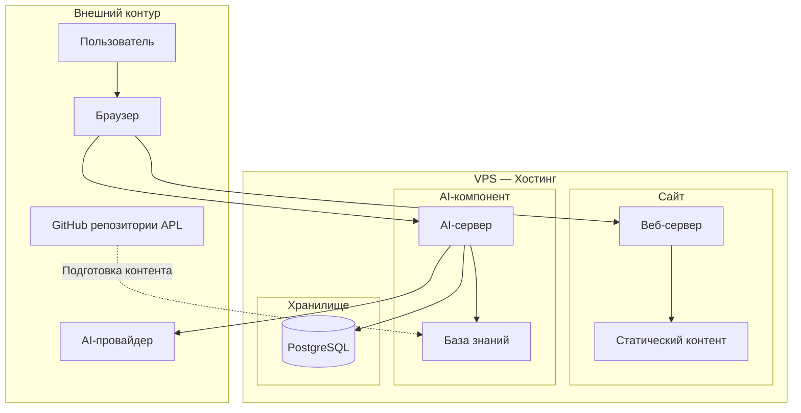
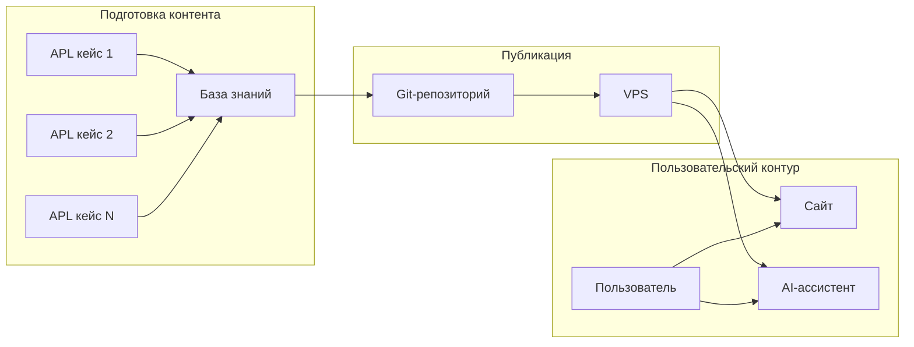
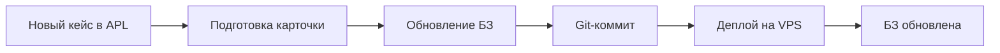

# ARCHITECTURE.md — Архитектура проекта

**Проект:** ai-portfolio
**Версия:** 1.0
**Дата:** 2026-07-12
**Статус:** Утверждено

---

## 1. Обзор архитектуры

### 1.1. Назначение документа

Документ описывает архитектурные решения проекта ai-portfolio, принятые на основе:

| Документ | Назначение |
|----------|------------|
| `docs/PROJECT_STATE.md` | Решения владельца продукта |
| `docs/SPEC.md` | Продуктовая спецификация |
| `docs/IMPLEMENTATION_PLAN.md` | План реализации |
| Принятые решения владельца | Архитектурные SOT |

### 1.2. Принципы архитектуры

| Принцип | Описание |
|---------|----------|
| **Простота** | Минимально необходимая сложность |
| **Изоляция** | Сайт и AI-компонент независимы от runtime существующих сервисов |
| **Единый источник истины** | Репозитории APL — источник контента кейсов |
| **Обновляемость через Git** | Контент обновляется через репозиторий проекта |
| **Безопасность** | API-ключи не публичны, секреты в переменных окружения |
| **Верифицируемость кейсов** | Каждый опубликованный кейс должен предоставлять возможность проверки его реальности через публичные артефакты |
| **Deployment Validation** | Обязательная валидация процесса развёртывания перед публикацией |

---

## 2. Общая архитектурная схема

### 2.1. Контур системы



### 2.2. Потоки данных



---

## 3. Основные компоненты

### 3.1. Сайт (пользовательский интерфейс)

| Компонент | Назначение | Технология |
|-----------|------------|------------|
| **Веб-сервер** | Обслуживание HTTP-запросов | Веб-сервер |
| **Статический контент** | HTML, CSS, JS, изображения | Файловая система |
| **Страницы** | Главная, Портфолио, Услуги, Контакты | Статический HTML |

**Характеристики:**
- Не зависит от AI-компонента для работы
- При недоступности AI продолжает работать
- Обновляется через Git

### 3.2. AI-компонент

| Компонент | Назначение | Технология |
|-----------|------------|------------|
| **AI-сервер** | Обработка запросов к AI | Серверный компонент |
| **База знаний** | Информация о кейсах и услугах | Хранилище данных |
| **Интеграция с AI-провайдером** | Запросы к AI-провайдеру | API |

**Характеристики:**
- Работает с собственной базой знаний
- Не обращается к GitHub во время запроса
- Логирует взаимодействия в PostgreSQL

### 3.3. Хранилище данных

| Компонент | Назначение | Данные |
|-----------|------------|---------|
| **PostgreSQL** | Основное серверное хранилище | Логи взаимодействий, метрики |
| **База знаний** | Контент для AI | Информация о кейсах и услугах |

---

## 4. Взаимодействие компонентов

### 4.1. Сайт → Пользователь

```
Пользователь → Браузер → Веб-сервер → Статический контент → Браузер → Пользователь
```

**Характеристики:**
- Не требует обращения к AI-компоненту
- Не требует подключения к БД
- Кешируется на уровне веб-сервера

### 4.2. AI-компонент → Пользователь

```
Пользователь → Браузер → AI-сервер → База знаний → AI-провайдер → AI-сервер → PostgreSQL → Браузер → Пользователь
```

**Характеристики:**
- Синхронный запрос-ответ
- Логирование каждого взаимодействия
- Fallback при недоступности AI

### 4.3. Подготовка контента

```
APL репозитории → Извлечение данных → Формирование БЗ → Git-репозиторий → VPS
```

**Характеристики:**
- Происходит offline, не влияет на работу сайта
- БЗ формируется из публичных материалов APL
- Обновление через Git-push

---

## 5. Организация базы знаний

### 5.1. Источники данных

| Источник | Данные | Формат |
|----------|--------|--------|
| **Репозитории APL** | README, документация кейсов | Markdown |
| **Материалы проекта** | Описания услуг, контакты | Markdown / JSON |

### 5.2. Структура базы знаний

**Принцип:** БЗ формируется из публичных материалов проектов APL и не обращается к GitHub во время пользовательского запроса.

| Раздел | Содержание | Обновление |
|--------|------------|------------|
| Кейсы | Описания 7 кейсов APL | При публикации нового кейса |
| Услуги | Специализация, решаемые задачи | При изменении позиционирования |
| FAQ | Частые вопросы и ответы | При необходимости |

**Открытый архитектурный вопрос:**
- Формат и место хранения БЗ определяются на этапе реализации серверного компонента

### 5.3. Процесс обновления БЗ



---

## 6. Стратегия хранения контента

### 6.1. Статический контент

| Тип | Хранение | Обновление |
|-----|----------|------------|
| **HTML-страницы** | Файловая система VPS | Git-push |
| **CSS/JS** | Файловая система VPS | Git-push |
| **Изображения** | Файловая система VPS | Git-push |
| **Шрифты** | Файловая система VPS | Git-push |

### 6.2. Динамический контент (логи)

| Тип | Хранение | Обновление |
|-----|----------|------------|
| **Логи взаимодействий** | PostgreSQL | В реальном времени |
| **Метрики** | PostgreSQL | В реальном времени |

### 6.3. База знаний

| Тип | Хранение | Обновление |
|-----|----------|------------|
| **Контент БЗ** | Хранилище данных (формат определяется на этапе реализации) | При деплое |

---

## 7. Демонстрация кейсов

### 7.1. Принцип верифицируемости

**Архитектурный принцип:** Каждый опубликованный кейс должен предоставлять возможность проверки его реальности через один или несколько публичных артефактов.

| Артефакт | Описание | Требование |
|----------|----------|------------|
| **GitHub** | Публичный репозиторий с исходным кодом | Обязательно для всех кейсов |
| **Live Demo** | Работающий экземпляр проекта | Опционально, для безопасных кейсов |
| **Demo Video** | Видеодемонстрация работы | Опционально, для сложных кейсов |

**Обоснование:** Позволяет заказчикам самостоятельно убедиться в реализованности кейсов.

### 7.2. Способы демонстрации

Для каждого кейса определяется один или несколько способов проверки:

| Способ | Применимость | Нагрузка |
|--------|--------------|----------|
| **GitHub** | Все кейсы | Нет нагрузки на инфраструктуру |
| **Live Demo** | Безопасные кейсы | Контролируемая нагрузка |
| **Demo Video** | Сложные кейсы | Нет нагрузки на инфраструктуру |

### 7.2. Live Demo — принципы использования

| Принцип | Описание |
|---------|----------|
| **Безопасность** | Live Demo только для кейсов без чувствительных данных |
| **Изоляция** | Live Demo не должен создавать неоправданную нагрузку на существующую инфраструктуру |
| **API-лимиты** | Учёт лимитов при публичном доступе |
| **Отключаемость** | Возможность быстро отключить Live Demo при проблемах |

### 7.3. Публикация нового кейса

**Требования для публикации:**

| Этап | Требование |
|------|------------|
| **Карточка сайта** | Название, задача, решение, результат, технологии, изображение |
| **Публичный GitHub** | Исходный код с README |
| **Описание** | Подробное описание в README |
| **Изображения** | Скриншоты, диаграммы |
| **Live Demo / Video** | Один или оба способа |

---

## 8. Логирование

### 8.1. Принципы логирования

**Архитектурный принцип:** Логирование следует единому подходу, принятому в APL.

| Принцип | Описание |
|---------|----------|
| **Структурированные логи** | Логи в структурированном формате для аналитики |
| **Единая схема** | Схема логов согласуется с существующими кейсами APL |
| **PostgreSQL как хранилище** | Основное хранилище для логов взаимодействий |

### 8.2. Что логируется

| Событие | Уровень | Хранение |
|---------|---------|----------|
| **Запрос к AI** | INFO | PostgreSQL |
| **Ответ AI** | INFO | PostgreSQL |
| **Ошибка AI** | ERROR | PostgreSQL |
| **Время ответа** | INFO | PostgreSQL |
| **Данные пользователя** | — | Не логируются |

### 8.2. Структура логов

**Открытый архитектурный вопрос:**
- Схема хранения логов в PostgreSQL — определяется на этапе реализации

### 8.3. Ротация логов

| Период | Действие |
|--------|----------|
| Ежедневно | Запись в PostgreSQL |
| Ежемесячно | Агрегация для аналитики |
| По необходимости | Архивация старых логов |

---

## 9. Мониторинг

### 9.1. Метрики для отслеживания

| Метрика | Источник | Цель |
|---------|----------|------|
| **Доступность сайта** | Веб-сервер | uptime 24/7 |
| **Доступность AI** | AI-сервер | fallback при недоступности |
| **Время ответа AI** | AI-сервер | контроль latency |
| **Количество запросов** | Логи | контроль нагрузки |
| **Ошибки** | Логи | оперативное реагирование |

### 9.2. Алертинг

**Открытый архитектурный вопрос:**
- Способ алертинга (email / Telegram / мониторинг-система) — определяется на этапе эксплуатации

### 9.3. Дашборды

**Открытый архитектурный вопрос:**
- Нужны ли дашборды мониторинга в первой версии — определяется на этапе эксплуатации

---

## 10. Безопасность

### 10.1. Защита секретов

| Секрет | Хранение | Доступ |
|--------|----------|--------|
| **API-ключ AI-провайдера** | Переменные окружения | Только AI-сервер |
| **Данные БД** | Переменные окружения | Только серверные компоненты |
| **Конфигурация** | Переменные окружения | Только серверные компоненты |

**Принцип:** Секреты не коммитятся в Git, хранятся в переменных окружения.

### 10.2. Защита пользовательских данных

| Данные | Политика |
|--------|----------|
| **IP-адреса** | Не сохраняются |
| **Персональные данные** | Не собираются |
| **Текст запросов** | Логируются для улучшения качества |
| **Ответы AI** | Логируются для улучшения качества |

### 10.3. Защита от злоупотреблений

**Открытый архитектурный вопрос:**
- Нужна ли защита от ботов (rate limiting / CAPTCHA) в первой версии — определяется на этапе эксплуатации

### 10.4. HTTPS

| Требование | Реализация |
|------------|------------|
| **TLS/SSL-сертификат** | TLS-сертификат для HTTPS |
| **Принудительный HTTPS** | Редирект с HTTP |
| **HSTS** | Включено |

---

## 11. Размещение на VPS

### 11.1. Существующая инфраструктура

| Компонент | Назначение |
|-----------|------------|
| **VPS** | Хостинг сайта и AI-компонента |
| **PostgreSQL** | Основное серверное хранилище |
| **Домен** | Привязка к проекту |
| **TLS/SSL** | Сертификаты для HTTPS |

### 11.2. Deployment Validation

**Архитектурный принцип:** Deployment Validation является обязательной частью эксплуатационной архитектуры проекта, проводимой перед финальной публикацией по решению владельца проекта. Она не блокирует промежуточные этапы разработки.

| Требование | Описание |
|------------|----------|
| **Валидация перед публикацией** | DEPLOYMENT_GUIDE должен быть протестирован в чистом окружении |
| **Воспроизводимость** | Проект должен разворачиваться с нуля по DEPLOYMENT_GUIDE |
| **Отчёт о валидации** | Deployment Validation Report фиксирует успешную валидацию |

**Связь с APL:** Процесс Deployment Validation следует инженерным стандартам APL. Выполняется перед финальной публикацией, не является обязательным на каждом промежуточном этапе разработки.

### 11.3. Изоляция проекта

| Принцип | Описание |
|---------|----------|
| **Нет runtime-зависимостей** | Сайт не зависит от существующих сервисов APL |
| **Изолированный контур** | Проект работает в собственном контуре |
| **Общее хранилище** | PostgreSQL используется как основное хранилище |

### 11.3. Конфигурация

**Открытый архитектурный вопрос:**
- Способ изоляции процессов (Docker / systemd / другое) — определяется на этапе реализации

---

## 12. Принципы масштабирования

### 12.1. Горизонтальное масштабирование

| Компонент | Масштабируемость |
|-----------|-----------------|
| **Сайт** | Кеширование, CDN |
| **AI-компонент** | Возможность запуска нескольких экземпляров |
| **PostgreSQL** | Возможность репликации |

### 12.2. Вертикальное масштабирование

| Компонент | Масштабируемость |
|-----------|-----------------|
| **VPS** | Увеличение ресурсов при необходимости |
| **PostgreSQL** | Оптимизация запросов |

### 12.3. Текущие ограничения

| Ограничение | Причина |
|-------------|---------|
| **Один экземпляр AI** | Первая версия, низкая нагрузка |
| **Одна БД** | Первая версия, низкая нагрузка |
| **Нет балансировщика** | Первая версия, один сервер |

**Принцип:** Масштабирование при необходимости, не преждевременно.

---

## 13. Открытые архитектурные вопросы

> Решения, которые не были приняты на уровне владельца продукта и требуют определения на этапе реализации.

### 13.1. Технические решения

| Вопрос | Категория | Контекст |
|--------|-----------|----------|
| Формат и место хранения БЗ | Данные | Определяется на этапе реализации серверного компонента |
| Способ реализации UI | Архитектура | Статический / динамический / гибридный |
| Архитектура серверного компонента | Архитектура | Монолит / микросервисы / другое |
| Механизм работы с БЗ | Архитектура | RAG / простой поиск / другое |
| Способ изоляции процессов | Инфраструктура | Docker / systemd / другое |
| Схема хранения логов | Данные | Таблицы PostgreSQL, согласуется с APL |

### 13.2. Эксплуатационные решения

| Вопрос | Категория | Контекст |
|--------|-----------|----------|
| Способ алертинга | Мониторинг | Email / Telegram / мониторинг-система |
| Нужны ли дашборды | Мониторинг | В первой версии или позже |
| Защита от ботов | Безопасность | Rate limiting / CAPTCHA / без защиты |

### 13.3. Решение вопросов

**Принцип:** Открытые вопросы решаются на этапе реализации серверного компонента (Этап 3 в IMPLEMENTATION_PLAN.md).

---

## 14. Соответствие SOT

### 14.1. Решения PROJECT_STATE.md

| Решение | Реализация в архитектуре |
|---------|-------------------------|
| Сайт — главная точка входа | Статический контент, кеширование |
| Telegram — канал связи | Не часть архитектуры первой версии |
| AI-провайдер | AI-компонент использует AI-провайдера |
| VPS — хостинг | Проект развёрнут на существующем VPS |
| PostgreSQL — хранилище | Основное серверное хранилище |

### 14.2. Решения SPEC.md

| Решение | Реализация в архитектуре |
|---------|-------------------------|
| 4 страницы сайта | Статический HTML |
| 7 кейсов портфолио | Страницы кейсов, БЗ |
| AI-ассистент | AI-компонент с собственной БЗ |
| Каналы связи | Ссылки на Telegram и Email |

### 14.3. Решения IMPLEMENTATION_PLAN.md

| Этап | Архитектурное решение |
|------|----------------------|
| Этап 0 | Подготовка БЗ из публичных материалов |
| Этап 1 | Пользовательский интерфейс (статический) |
| Этап 2 | Деплой на VPS |
| Этап 3 | Серверный компонент (AI) |
| Этап 4 | Интеграция |
| Этап 5 | Deployment Validation |

### 14.4. Принятые решения владельца

| Решение | Реализация в архитектуре |
|---------|-------------------------|
| Источник контента — репозитории APL | БЗ формируется из публичных материалов |
| Обновление через Git | Контент в Git-репозитории проекта |
| AI работает по собственной БЗ | БЗ не обращается к GitHub при запросе |
| Демонстрация кейсов | GitHub, Live Demo, Demo Video |
| PostgreSQL — основное хранилище | Логи, метрики, БЗ (опционально) |
| Сайт + AI-компонент | Изолированные контуры |
| Публикация кейса | Карточка + GitHub + описание + изображения + demo |

---

## 15. Операционный runbook

### 15.1. Симптом: Admin Console возвращает 404 на `/api/admin/*`

**Когда возникает:** после обновления `src/nginx.conf` или пересборки frontend-образа контейнер `ai-portfolio` может продолжать работать со старой конфигурацией nginx в памяти. Запросы к `/api/admin/...`, `/project-cards`, `/track-visit`, `/chat` попадают в fallback на статику и возвращают 404, хотя backend и маршруты живы.

**Как проверить:**

```bash
# изнутри контейнера nginx запрос должен уходить на backend
docker exec ai-portfolio curl -s http://localhost/api/admin/ai-providers \
  -H 'Authorization: Bearer test-token'
# ожидаемый ответ: 401/403 от backend, НЕ 404 от nginx

# публичный health должен быть 200
curl -s https://ai.alex-n8n.site/health
```

**Как починить:**

```bash
# перезагрузить nginx без остановки контейнера
docker exec ai-portfolio nginx -s reload
```

После reload запросы `/api/admin/*` снова проксируются на backend.

**Как избежать повторения:**

- После любого изменения `src/nginx.conf` выполнять `docker compose up -d --build --force-recreate ai-portfolio-frontend` или `docker exec ai-portfolio nginx -s reload`.
- Добавить reload в post-deploy hook / CI-скрипт.
- Не использовать `pkill` или `kill` для управления nginx/backend на shared-хосте — см. паттерн `shared/patterns/multi-tenant-pkill-incident.md`.

## История изменений

| Дата | Версия | Изменения |
|------|--------|-----------|
| 2026-07-12 | 1.0 | Первая версия ARCHITECTURE.md на основе SOT и принятых решений |
| 2026-07-12 | 1.1 | Финальный редакторский проход: нейтральные формулировки, единообразие БЗ, связь с APL, принцип верифицируемости |
| 2026-08-21 | 1.2 | Добавлен операционный runbook: nginx reload после обновления конфигурации; устранён инцидент 404 на `/api/admin/*` |