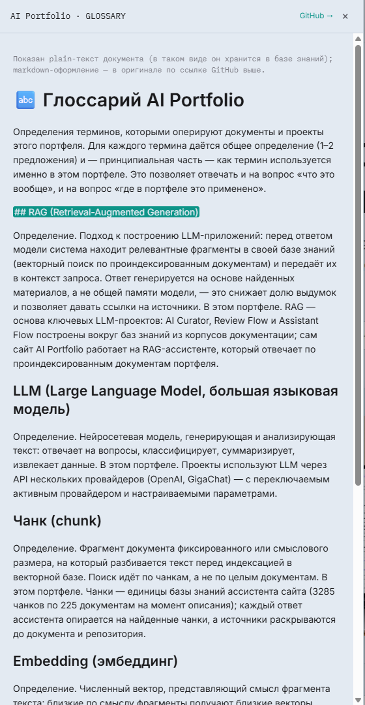
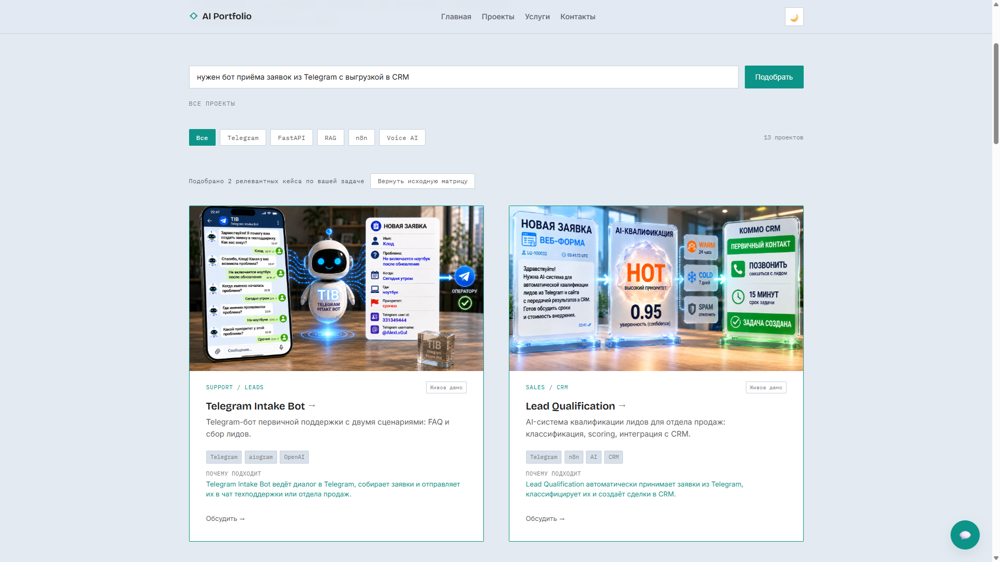
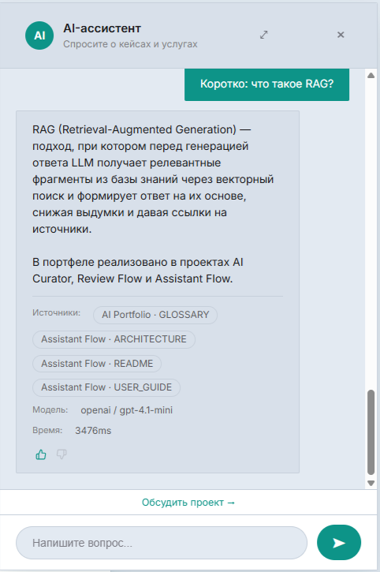
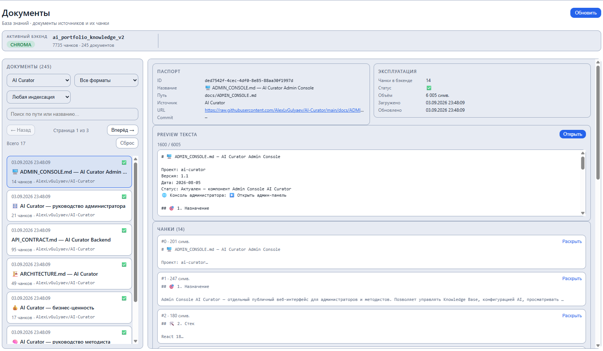
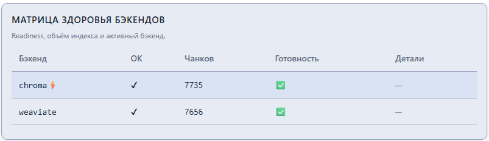

# 🎬 E2E_SCENARIOS — AI Portfolio

**Основной читатель:** заказчик и менеджер — как система ведёт себя сквозным образом.
**Назначение:** реальные сквозные сценарии от входа до результата, описанные по фактической реализации. Внутри — шаги и ожидаемый результат каждого этапа; JSON, SQL и внутренние параметры — в [`docs/ARCHITECTURE.md`](ARCHITECTURE.md).

> 📌 **SOT:** каждый сценарий основан на работающих компонентах production-развёртывания (чат-контур, admission gate, Admin Console, multi-provider LLM). Живое воспроизведение — https://ai.alex-n8n.site и https://af-admin.alex-n8n.site.

---

## 🎬 1. Сценарии гостя сайта

### 1.1. 💬 Вопрос о кейсе → ответ с источниками

| Шаг | Действие | Результат |
|-----|----------|-----------|
| 1 | Гость открывает https://ai.alex-n8n.site и открывает чат-виджет | Виджет создаёт сессию диалога |
| 2 | Гость спрашивает: «Какие у тебя кейсы про обработку резюме?» | Запрос попадает в чат-контур: классификация → retrieval по базе знаний → сборка ответа |
| 3 | Ассистент отвечает | Ответ содержит релевантные кейсы (HR Assistant, LoRA fine-tuning), по одному подтверждению из документации на кейс, и карточки источников (`репозиторий · документ`) |
| 4 | Гость нажимает карточку источника | Открывается панель документа: фрагмент документа с подсвеченным цитированным местом, ссылка «GitHub →» на оригинал; закрытие — крестик, Esc, клик мимо |

Что гарантируется на шаге 3: факты о составе портфеля ассистент берёт только из официального реестра проектов; утверждения о реализации — только из одобренных документов; каждый содержательный ответ сопровождается источниками.

*IMG-007 — панель документа по клику на карточку источника:*

### 1.2. 🤖 Вопрос вне портфеля → честный ответ

| Шаг | Действие | Результат |
|-----|----------|-----------|
| 1 | Гость спрашивает о теме, отсутствующей в портфеле | Классификация распознаёт вопрос по теме |
| 2 | Retrieval и реестр подтверждают: прямого кейса по теме нет | Срабатывает правило честности |
| 3 | Ассистент отвечает | Начало ответа — прямое: «Прямого кейса про X в портфеле нет»; далее — 1–2 ближайших по смыслу кейса одной строкой с пояснением близости |

### 1.3. 🛣️ Путь к контакту

| Шаг | Действие | Результат |
|-----|----------|-----------|
| 1 | Гость читает лендинг кейса (результат, метрики, сценарии) | Понимает, что реализовано и чем подтверждено |
| 2 | Открывает «Услуги» → «Контакты» | Форма и состав сообщения для обращения |
| 3 | Визит, открытие чата и вопросы фиксируются в пресейл-воронке | Владелец видит путь гостя в «Аналитика → Пресейл» |

*IMG-008 — страница «Контакты»: каналы обращения и состав первого сообщения:*

### 1.4. 🧲 Подбор кейса под задачу (сцена на главной)

| Шаг | Действие | Результат |
|-----|----------|-----------|
| 1 | Гость описывает задачу в поле «какая у вас задача» на главной | Запрос уходит в `POST /case-match` |
| 2 | Платформа подбирает кейсы | До 3 релевантных кейсов, каждый — с одной строкой «почему подходит» (объяснение по документам, без обещаний статусов и цен) |
| 3 | Если прямого кейса под задачу нет | Показаны 1–2 ближайших по смыслу с честной оговоркой |
| 4 | Гость нажимает «Все» | Возвращается полная витрина |

*IMG-006 — сцена подбора: задача «нужен бот приёма заявок из Telegram с выгрузкой в CRM», подобранные кейсы со строками «почему подходит»:*

### 1.5. 👍 Оценка ответа ассистента

| Шаг | Действие | Результат |
|-----|----------|-----------|
| 1 | Гость получает ответ ассистента | Под ответом — кнопки 👍 / 👎 |
| 2 | Гость ставит оценку | Событие `chat_feedback` фиксируется анонимно (аналитика качества ответов) |

*IMG-014 — короткий ответ ассистента с кнопками 👍/👎:*

---

## 🎛️ 2. Сценарии администратора

### 2.1. 🔄 Новый кейс попадает в базу знаний

| Шаг | Действие | Консоль |
|-----|----------|---------|
| 1 | Создана карточка проекта | «Карточки проектов» |
| 2 | Добавлен GitHub-репозиторий кейса как источник | «Источники и синхронизация» |
| 3 | Заданы draft-правила (какие документы индексируем) | Draft-панель источника |
| 4 | Снято превью состава — фиксируется по commit SHA | Immutable preview |
| 5 | Состав утверждён, правила стали эффективными | Статус ✅ Одобрен |
| 6 | Запущена синхронизация — документы ушли в векторный индекс | Статус синхронизации, счётчик документов и чанков |
| 7 | Контрольный вопрос ассистенту на сайте подтверждает новые знания | Чат отвечает с указанием нового источника |

### 2.2. 📥 Обновление документации кейса в GitHub

| Шаг | Действие | Консоль |
|-----|----------|---------|
| 1 | В репозитории кейса появились новые коммиты | Источник переходит в «🔄 Есть изменения» |
| 2 | Администратор снимает свежее превью (новый commit SHA) | Immutable preview обновлён |
| 3 | Состав утверждён, синхронизация выполнена | Статус ✅ Одобрен, счётчик обновлён |
| 4 | Кеш ответов инвалидируется автоматически | Ассистент отвечает по обновлённым документам |

Контроль состава корпуса после обновления — консоль «Документы»:

*IMG-013 — состав корпуса по файлам и источникам:*

### 2.3. 📝 Смена системного промпта

| Шаг | Действие | Консоль |
|-----|----------|---------|
| 1 | В «Система → AI-настройки» отредактирован промпт, создана новая версия | Версия сохранена в историю |
| 2 | Версия активирована | Кеш ответов инвалидируется автоматически |
| 3 | Контрольный вопрос подтверждает новое поведение | Ответ ассистента отражает обновлённые правила |
| 4 | При необходимости — откат к любой исторической версии или к вшитому fallback | Одно действие в списке версий |

*IMG-010 — панель «Системный промпт»: активная версия и история версий:*

### 2.4. 🔌 Отказ основного LLM-провайдера → фоллбэк

| Шаг | Действие | Результат |
|-----|----------|-----------|
| 1 | OpenAI стал отвечать ошибками | Чат-контур детектирует сбой провайдера |
| 2 | Ответ собирается через GigaChat fallback | Гость получает ответ; переключение фиксируется в аудите |
| 3 | Администратор видит переключение в «Наблюдаемость → Аудит» | Журнал провайдеров: активный → fallback (запись admin-действия `activate ai_config`) |

*IMG-009 — аудит: записи admin-действий, среди них смена активного провайдера:*

### 2.5. 🩺 Проверка здоровья системы

| Шаг | Действие | Консоль |
|-----|----------|---------|
| 1 | Открыт «Система → Обзор» | Статусы PostgreSQL, векторного стора, LLM-провайдеров; объём KB; Last Sync |
| 2 | Открыта «Система → Retrieval» | Матрица здоровья бэкендов: активный бэкенд (⚡), объём чанков, готовность каждого |
| 3 | Контрольный вопрос ассистенту на сайте | Ответ со источниками — штатный путь работает |

*IMG-012 — «Система → Обзор»:*

*IMG-011 — матрица здоровья векторных бэкендов:*

---

## 🧭 3. Границы сценариев

- Все сценарии воспроизводятся на живом развёртывании; их техническая механика (эндпоинты, схемы данных, миграции) — [`docs/ARCHITECTURE.md`](ARCHITECTURE.md), [`docs/DEPLOYMENT_GUIDE.md`](DEPLOYMENT_GUIDE.md).
- Операционные шаги администратора — [`docs/ADMIN_GUIDE.md`](ADMIN_GUIDE.md).
- Качество шагов 1.1–1.2 подтверждено eval-кампанией — [`docs/AI_EVAL_REPORT.md`](AI_EVAL_REPORT.md).
- Сценарии 1.4–1.5 добавлены по реализации 03.09.2026 (Morphic-проба, панель документа, оценка ответов); их полный UX-контур — [`docs/ROADMAP.md`](ROADMAP.md) §5.

---

## 📚 Связанные документы

- [🏠 `README.md`](../README.md) — обзор проекта и live demo.
- [🎬 `docs/SYSTEM_DEMO.md`](SYSTEM_DEMO.md) — продукт как работающая система.
- [💼 `docs/BUSINESS_VALUE.md`](BUSINESS_VALUE.md) — бизнес-ценность.
- [🎛️ `docs/ADMIN_GUIDE.md`](ADMIN_GUIDE.md) — операции администратора.
- [🏗️ `docs/ARCHITECTURE.md`](ARCHITECTURE.md) — архитектура.