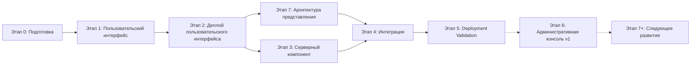

# IMPLEMENTATION_PLAN.md — План реализации первой версии

**Проект:** ai-portfolio
**Версия:** 1.0
**Дата:** 2026-07-12
**Статус:** Завершён в объёме уроков Prompt Engineering. Проект находится под управлением Git, репозиторий инициализирован.

---

## 1. Обзор плана

### Исходные документы (SSOT)

| Документ | Назначение |
|----------|------------|
| `docs/PROJECT_STATE.md` | Решения владельца продукта |
| `docs/SPEC.md` | Продуктовая спецификация |

### Продукт первой версии

Персональный сайт AI-инженера с интегрированным AI-ассистентом и административной консолью v1.

**Состав:**
- Сайт-портфолио (4 страницы)
- 7 страниц кейсов
- AI-ассистент (интеграция с сайтом)
- База знаний о кейсах и услугах
- Каналы связи (Telegram, Email)
- Административная консоль v1 (Dashboard, Content / Knowledge Base, Logs / Conversations)

**Не входит:**
- Страница «О себе» (представление на главной)
- Форма обратной связи
- Telegram-бот
- Расширенные рабочие пространства админ-консоли (Providers, Analytics, Cache, Health)
- GitHub Sync как автоматическая синхронизация (webhook)

### Существующая инфраструктура APL

| Ресурс | Описание | Использование |
|--------|----------|---------------|
| **VPS** | Существующий сервер | Деплой проекта |
| **PostgreSQL** | База данных | Основное серверное хранилище проекта |
| **Домены** | Управление доменами | Привязка домена к проекту |
| **GitHub** | Репозитории кейсов | Публикация проекта |
| **Deployment Validation** | Отлаженный процесс | Валидация деплоя |
| **Существующие кейсы** | 7 production-ready проектов | Контент для портфолио |

---

## 2. Этапы реализации

### Диаграмма этапов



**Примечание:** Административная консоль v1 была реализована в рамках текущей итерации после завершения базового продукта. Пунктирные линии показывают, что это развитие, а не часть первоначального критического пути.

---

## 3. Этап 0: Подготовка

**Статус:** ✅ Завершён

### Цель

Подготовить все необходимые материалы для начала разработки: контент, дизайн, базу знаний.

### Результат

| Артефакт | Содержание | Статус |
|----------|------------|--------|
| Тексты главной | Представление владельца, призыв к действию | ✅ |
| Описания кейсов | 7 файлов с описаниями | ✅ |
| Описание услуг | Текст для раздела «Услуги» | ✅ |
| Контакты | Telegram username, Email | ✅ |
| База знаний | JSON-файл для AI-ассистента | ✅ |
| Стилевая концепция | Цвета, шрифты, компоновка | ✅ |

---

## 4. Этап 1: Пользовательский интерфейс

**Статус:** ✅ Завершён (2026-07-13)

### Цель

Реализовать пользовательский интерфейс сайта-портфолио.

### Результат

| Артефакт | Содержание |
|----------|------------|
| Пользовательский интерфейс | 4 страницы + 7 страниц кейсов = 11 страниц |
| Исходный код | `src/` — vanilla HTML/CSS/JS |
| Локальная версия | Работающий сайт на localhost |
| Продакшн версия | Работающий сайт на VPS по адресу https://ai.alex-n8n.site |

### Критерии завершения

- [x] Главная страница отображается корректно
- [x] Все 7 кейсов отображаются в каталоге
- [x] Каждая страница кейса открывается и отображает полную информацию
- [x] Страница «Услуги» отображается
- [x] Страница «Контакты» отображается с рабочими ссылками
- [x] Навигация работает между всеми страницами
- [x] Сайт отображается корректно на desktop и mobile
- [x] Визуальный стиль соответствует инженерному минимализму

---

## 5. Этап 2: Деплой пользовательского интерфейса

**Статус:** ✅ Завершён (2026-07-13)

### Цель

Развернуть пользовательский интерфейс на существующем VPS и обеспечить доступность по домену.

### Результат

| Артефакт | Содержание |
|----------|------------|
| Работающий интерфейс | Сайт доступен по HTTPS |
| Конфигурация сервера | Docker, nginx, Traefik |
| SSL-сертификат | Let's Encrypt |
| Домен | ai.alex-n8n.site настроен и работает |

### Критерии завершения

- [x] Сайт доступен по HTTPS
- [x] Сайт доступен по домену https://ai.alex-n8n.site
- [x] Все страницы открываются без ошибок
- [x] SSL-сертификат валидный

---

## 6. Этап 3: Серверный компонент

**Статус:** ✅ Завершён

### Цель

Реализовать серверный компонент для AI-ассистента, который отвечает на вопросы о кейсах и услугах.

### Этап 3.1: Backend Infrastructure ✅

**Реализовано:**
- Структура backend создана
- FastAPI запускается (порт 8000)
- PostgreSQL подключена (порт 5432)
- Миграции выполнены
- Таблицы: `ai_provider_settings`, `chat_sessions`, `chat_messages`, `operational_logs`
- Начальные данные: OpenAI (active), GigaChat (fallback)
- Docker образ собран

### Этап 3.2.1: Service Layer — Basic Services ✅

**Реализовано:**
- Conversation Memory Service (из Assistant Flow)
- Chat Session Service (из Assistant Flow)
- Operational Log Service (из Review Flow + PEcf09 + Assistant Flow)
- AI Provider Settings Service (из Review Flow)

### Этап 3.2.2: Service Layer — RAG & Cache ✅

**Реализовано:**
- Response Cache (из PEcf09) — кеширование ответов с TTL
- RAG Service (из Assistant Flow + PEcf09) — поиск по базе знаний через ChromaDB
- Knowledge Base Indexer (из PEcf09) — индексация JSON в ChromaDB

### Этап 3.3: REST API & Integration ✅

**Реализовано:**
- Chat Endpoint `POST /chat`
- Health endpoint `GET /health`
- Root endpoint `GET /`
- Интеграция с frontend через `src/js/api-client.js` и `src/js/chat-widget.js`

### Результат

| Артефакт | Содержание | Статус |
|----------|------------|--------|
| Backend Infrastructure | FastAPI + PostgreSQL + миграции | ✅ |
| Service Layer | Memory, Session, Log, Provider, Cache, RAG | ✅ |
| REST API | Chat endpoint, Health endpoint | ✅ |
| UI-компонент | Chat widget на всех страницах | ✅ |
| Интегрированный сайт | Сайт + AI-ассистент работают вместе | ✅ |

### Критерии завершения

- [x] Backend Infrastructure создана
- [x] Basic Services реализованы
- [x] RAG & Cache Services реализованы
- [x] REST API работает (Chat endpoint)
- [x] AI-ассистент отвечает на вопросы о кейсах
- [x] AI-ассистент отвечает на вопросы об услугах
- [x] При недоступности AI — сайт продолжает работать (fallback + error handling)
- [x] API-ключи не доступны публично

---

## 7. Этап 7: Архитектура представления кейсов

**Статус:** ✅ Частично завершён (Lead Qualification реализован как эталон)

### Цель

Привести все существующие кейсы AI Portfolio к архитектуре представления: Narrative Blueprint + Presentation Patterns.

### Результат

| Артефакт | Содержание | Статус |
|----------|------------|--------|
| Narrative Blueprint Lead Qualification | Эталонная реализация | ✅ |
| Страница Lead Qualification | Scene Navigation, Presentation Patterns | ✅ |
| Остальные кейсы | Традиционные страницы с превью | ✅ |

### Примечание

Остальные кейсы (Assistant Flow, Review Flow, HR Assistant, Prompt Review, Telegram AI Gateway, Competitor Monitor AI) используют классические страницы кейсов. Переход на Narrative Blueprint + Scene Navigation является следующим этапом развития контента, но не блокирует текущую публикацию.

---

## 8. Этап 4: Интеграция и тестирование

**Статус:** ✅ Завершён

### Цель

Объединить все компоненты и протестировать работоспособность.

### Результат

| Артефакт | Содержание |
|----------|------------|
| Интегрированный сайт | Сайт + AI-ассистент работают вместе |
| E2E тесты | Проверены пользовательские сценарии |
| README | Описание проекта и способ запуска |

### Критерии завершения

- [x] Все пользовательские сценарии из SPEC работают
- [x] AI-ассистент отвечает корректно
- [x] Сайт доступен 24/7
- [x] При падении AI сайт продолжает работать
- [x] API-ключи не доступны публично

---

## 9. Этап 5: Deployment Validation

**Статус:** ⏳ Следующий этап

### Цель

Подтвердить, что `DEPLOYMENT_GUIDE` позволяет развернуть проект с нуля в чистом окружении.

### Состав работ

| Работа | Описание | Зависит от |
|--------|----------|------------|
| **Чистое окружение** | Подготовка чистого сервера/VM | — |
| **Проход по DEPLOYMENT_GUIDE** | Выполнение инструкций шаг за шагом | Этап 4 |
| **Фиксация проблем** | Документирование несоответствий | — |
| **Исправление DEPLOYMENT_GUIDE** | Актуализация инструкций | — |
| **Повторная валидация** | Повторный проход по исправленному guide | — |
| **Deployment Validation Report** | Отчёт о валидации | — |

### Критерии завершения

- [ ] DEPLOYMENT_GUIDE позволяет развернуть проект с нуля
- [ ] Все шаги DEPLOYMENT_GUIDE выполнены успешно
- [ ] Сайт работает корректно после чистого деплоя
- [ ] AI-ассистент работает корректно после чистого деплоя
- [ ] Deployment Validation Report документирует процесс

---

## 10. Этап 6: Административная консоль v1

**Статус:** ✅ Завершён (2026-07-15)

### Цель

Реализовать административную консоль для управления AI Portfolio. Консоль изначально планировалась как следующий этап развития продукта, но была реализована и интегрирована в production-контур в рамках текущей итерации.

Deployment Validation будет проведён по решению владельца проекта перед финальной публикацией.

### Реализованная функциональность

Первая версия содержит **только три рабочих пространства**:

| Пространство | Назначение | Границы |
|--------------|------------|---------|
| **Dashboard** | Единая сводная картина состояния AI Portfolio + управление параметрами LLM-провайдеров и выбор active/fallback | Мониторинг системы + управление LLM-провайдерами. Не управляет остальным содержимым |
| **Content / Knowledge Base** | Управление карточками проектов, содержимым портфолио, источниками KB, запуск синхронизации | Не редактирует Narrative Blueprint и Presentation Patterns; не является визуальным конструктором страниц |
| **Logs / Conversations** | Operational logs, история обращений, история диалогов, диагностика | — |

### Архитектура Knowledge Base

| Источник | Роль | Source of Truth |
|----------|------|-----------------|
| **GitHub** | Проектная документация | ✅ Да. Основной источник знаний |
| **PostgreSQL** | Управляемые данные сайта, эксплуатация, параметры LLM-провайдеров | ✅ Да |
| **ChromaDB** | Векторный поисковый индекс | ❌ Нет. Перестраивается из источников |

**Правила первой версии:**
- GitHub остаётся Source of Truth для проектной документации.
- **Временное техническое решение v1:** локальный файл `knowledge_base/knowledge.json` используется как источник для ручной синхронизации в ChromaDB, пока не реализован GitHub Sync. Это не меняет архитектурного статуса GitHub как SOT.
- Административная консоль управляет перечнем подключённых источников и инициирует их синхронизацию вручную.
- Автоматическая синхронизация по webhook не входит в первую версию.
- PostgreSQL не является основным хранилищем проектной документации.
- ChromaDB остаётся производным индексом и перестраивается из актуальных источников.

### Narrative Blueprint и Presentation Patterns

- **Narrative Blueprint** отвечает за то, что рассказывает страница проекта, порядок раскрытия материала и драматургию.
- **Presentation Patterns** отвечают за то, как информация отображается пользователю.
- Административная консоль не редактирует ни Narrative Blueprint, ни библиотеку Presentation Patterns.
- Административная консоль работает только с управляемым контентом внутри уже утверждённой структуры.

### Архитектурное решение

Техническая реализация административной консоли v1 зафиксирована в `docs/ADMIN_CONSOLE_ARCHITECTURE.md` и реализована:

| Компонент | Решение |
|-----------|---------|
| Frontend | React + TypeScript + Vite SPA в `admin/`, `base: '/admin/'` |
| Backend | FastAPI, единый префикс `/admin` |
| Аутентификация | Bearer token: `ADMIN_API_TOKEN` |
| Routing | React Router с `basename="/admin"` |
| Docker | Единый frontend-контейнер с multi-stage build |

### Примечание

Административная консоль v1 изначально планировалась как отдельный этап развития продукта, но была реализована в рамках текущей итерации. Она не входит в первоначальный критический путь уроков Prompt Engineering, но интегрирована в production-контур.

Окончательная техническая архитектура первой версии административной консоли согласована и зафиксирована в `docs/ADMIN_CONSOLE_ARCHITECTURE.md`. План реализации перенесён в настоящий документ (см. раздел 11).

---

## 11. Технический план реализации административной консоли

> Архитектура первой версии административной консоли согласована с владельцем проекта и зафиксирована в `task_history/2026-07-15_task-admin-console-final-architecture.md`.
> Реализация выполняется в пяти этапов. Deployment Validation не входит в эту последовательность и проводится отдельно по решению владельца проекта.

### 11.1. Этап 1: Backend Foundation ✅

**Статус:** Завершён (2026-07-15).

**Цель:** подготовить серверную основу административной консоли внутри единого FastAPI-приложения.

**Результат:**
- Модели данных `ProjectCard`, `KnowledgeSource`, `KnowledgeSyncJob` добавлены в `app/models/entities.py`.
- Модель `ProjectCard` содержит поля `display_order` (порядок в каталоге портфолио) и `show_on_homepage` (`0` — не отображать на главной, `1..4` — порядок на главной).
- Alembic-миграции для новых моделей созданы и применены.
- Административная аутентификация реализована через единый `ADMIN_API_TOKEN` (`app/api/admin/dependencies.py`).
- Создан каркас Admin API: пакет `app/api/admin/` с заглушками routers (`dashboard`, `knowledge_base`, `logs`, `conversations`).
- Routers подключены в `app/main.py` с префиксом `/admin`.

**Критерий завершения:**
- [x] `GET /admin/dashboard` (заглушка) возвращает 200 при валидном токене и 403 без него.
- [x] Миграции успешно применяются к PostgreSQL.
- [x] Структура `app/api/admin/` соответствует согласованной архитектуре.

---

### 11.2. Этап 2: Admin Frontend Foundation ✅

**Статус:** Завершён (2026-07-15).

**Цель:** создать отдельный frontend-модуль административной консоли на React + TypeScript + Vite.

**Результат:**
- Создан каталог `admin/` с Vite-конфигурацией (`vite.config.ts` с `base: '/admin/'`), TypeScript и React.
- Реализован Layout (`AdminLayout`), Navigation, ProtectedRoute, LoginPage, базовые UI-компоненты (Page, Card, Table, Toolbar, Loading, ErrorState, EmptyState), API client с Bearer-token.
- Маршрутизация: `/admin/login`, `/admin/dashboard`, `/admin/content`, `/admin/logs`.
- Проверена локальная сборка `npm run build`.

**Критерий завершения:**
- [x] `admin/` собирается без ошибок.
- [x] LoginPage принимает токен и сохраняет его в `localStorage`.
- [x] ProtectedRoute перенаправляет неавторизованного пользователя на `/admin/login`.
- [x] Навигация содержит три пункта: Dashboard, Content, Logs.

---

### 11.3. Этап 3: Infrastructure Integration ✅

**Статус:** Завершён (2026-07-15).

**Цель:** интегрировать admin frontend в существующую Docker-инфраструктуру AI Portfolio.

**Результат:**
- `src/Dockerfile` переработан в multi-stage: Stage 1 собирает `admin/` через Node.js, Stage 2 — nginx-образ с public + admin static files.
- `docker-compose.yml` обновлён: frontend-сервис собирается из корня проекта (`context: .`, `dockerfile: src/Dockerfile`).
- `src/nginx.conf` расширен маршрутами `/admin/` (static SPA с fallback на `index.html`) и `/api/admin/` (proxy на backend `/admin/`).
- `admin/src/main.tsx` получил `basename="/admin"` для корректного роутинга SPA.
- Backend endpoint `/admin/` доступен через `/api/admin/`.

**Критерий завершения:**
- [x] `docker compose build ai-portfolio-frontend` завершается успешно.
- [x] `curl /admin/` возвращает `admin/index.html`.
- [x] `curl /admin/dashboard` (refresh) возвращает `admin/index.html` (SPA fallback).
- [x] `curl /api/admin/dashboard` с токеном проксируется на backend `/admin/dashboard`.
- [x] `curl /api/admin/dashboard` без токена возвращает 403.
- [x] Публичные маршруты (`/`, `/chat`, `/health`, `/project-cards`) сохранены и работают.

---

### 11.4. Этап 4: Реализация трёх рабочих пространств

**Статус:** ✅ Завершён (2026-07-15).

**Цель:** реализовать функциональность трёх согласованных рабочих пространств.

**Результат:**

**Dashboard:**
- endpoint `/admin/dashboard` отдаёт сводные метрики: статус backend / PostgreSQL / ChromaDB, AI-провайдеры, ProjectCard, KnowledgeSource, sync, logs, conversations;
- endpoint `/admin/ai-providers` отдаёт параметры LLM-провайдеров из БД;
- endpoint'ы `PATCH /admin/ai-providers/{key}`, `POST .../activate`, `POST .../set-fallback`, `POST .../test` позволяют редактировать параметры, выбирать active/fallback и тестировать соединение;
- страница `DashboardPage.tsx` отображает метрики и редактируемые карточки провайдеров.

**Content / Knowledge Base:**
- CRUD управляемых карточек проектов (`ProjectCard`) — backend + frontend;
- CRUD источников Knowledge Base (`KnowledgeSource`) — backend + frontend;
- ручная синхронизация → ChromaDB через `POST /admin/knowledge-base/sync` (перестраивает коллекцию из `knowledge_base/knowledge.json` и `knowledge_content` карточек);
- панель статуса ChromaDB.

**Logs / Conversations:**
- endpoint `/admin/logs` с фильтрацией по `event_type`, `status`, `date_from`, `date_to` и пагинацией;
- endpoint `/admin/conversations` со списком сессий и пагинацией;
- endpoint `/admin/conversations/{id}` с деталями сессии и сообщениями;
- страница `LogsPage.tsx` с вкладками Logs / Conversations.

**Критерий завершения:**
- [x] Все три рабочих пространства доступны в UI и отвечают на действия пользователя.
- [x] Синхронизация Knowledge Base перестраивает ChromaDB.
- [x] Фильтры и пагинация работают в Logs / Conversations.
- [x] Пройден обязательный production smoke-test.


### 11.5. Этап 5: Интеграция и тестирование

**Статус:** ✅ Завершён в объёме Stage 4 (2026-07-15).

**Цель:** объединить backend, frontend и инфраструктуру в работоспособную систему.

**Результат:**
- Пройден E2E-проход по всем трём рабочим пространствам.
- Проверена аутентификация: доступ с токеном, отказ без токена.
- Проверена синхронизация источников и корректность ответов AI-ассистента после переиндексации.
- Production smoke-test пройден; регрессий не выявлено.

**Критерий завершения:**
- [x] Все критерии Этапов 1–4 выполнены.
- [x] Нет критических ошибок при ручном тестировании.

### 11.6. Deployment Validation

> **Deployment Validation не является частью последовательности реализации административной консоли.**

Deployment Validation выполняется **отдельно и только по решению владельца проекта** после завершения разработки. Он подтверждает, что обновлённый `DEPLOYMENT_GUIDE` позволяет развернуть проект с нуля в чистом окружении, включая административную консоль.

---

## 12. Сводка по этапам

| Этап | Название | Статус |
|------|----------|--------|
| 0 | Подготовка | ✅ |
| 1 | Пользовательский интерфейс | ✅ |
| 2 | Деплой пользовательского интерфейса | ✅ |
| 7 | Архитектура представления кейсов | ✅ (эталон Lead Qualification) |
| 3 | Серверный компонент | ✅ |
| 4 | Интеграция | ✅ |
| 5 | Deployment Validation | ⏳ Будет проведён по решению владельца продукта |
| 6 | Административная консоль v1 | ✅ Реализован и развёрнут (Stage 4) |

### Критический путь (завершён)

```
Этап 0 → Этап 1 → Этап 2 → Этап 7 → Этап 4
         ↓
       Этап 3 → Этап 4
```

---

## 13. Риски и зависимости

### Внешние зависимости

| Зависимость | Описание | Митигация |
|-------------|----------|-----------|
| **Контент от владельца** | Тексты для главной, кейсов, услуг | Уже подготовлен |
| **Домен** | Привязка домена к VPS | ai.alex-n8n.site настроен |
| **AI-провайдер API** | API-ключ и доступ | OpenAI + GigaChat fallback |
| **VPS** | Существующая инфраструктура | Проверить ресурсы, конфигурацию |

### Риски проекта

| Риск | Вероятность | Влияние | Митигация |
|------|-------------|---------|-----------|
| Задержка контента от владельца | Низкая | Высокое | Контент подготовлен |
| Качество ответов AI | Средняя | Среднее | Подготовлена база знаний |
| Стоимость API при нагрузке | Низкая | Низкое | Мониторинг использования |
| Проблемы с деплоем | Низкая | Среднее | Deployment Validation |
| Отсутствие изображений кейсов | Средняя | Среднее | Placeholder, запрос у владельца |

---

## 14. Критерии готовности первой версии

### Продуктовые критерии

| Критерий | Признак готовности |
|----------|-------------------|
| Сайт доступен | Работает по HTTPS, все страницы открываются |
| AI-ассистент работает | Отвечает на вопросы о кейсах и услугах |
| Каналы связи работают | Telegram и Email доступны |
| Контент актуален | Все 7 кейсов описаны, услуги описаны |
| Визуальный стиль | Соответствует инженерному минимализму |

### Технические критерии

| Критерий | Признак готовности |
|----------|-------------------|
| Деплой на VPS | Сайт развёрнут на существующем VPS |
| 24/7 доступность | Сайт работает постоянно |
| Fallback AI | При недоступности AI сайт продолжает работать |
| Безопасность | API-ключи не доступны публично |
| Docker-конфигурация | Единый `docker-compose.yml` как Source of Truth, управление через Docker Compose v2 |

### Документационные критерии

| Критерий | Признак готовности |
|----------|-------------------|
| DEPLOYMENT_GUIDE | Позволяет развернуть с нуля |
| Deployment Validation Report | Валидация пройдена |
| README | Описывает проект и способ запуска |

---

## 15. Следующие шаги

1. ~~Согласование плана с владельцем~~ — ✅ Выполнено
2. ~~Этап 0: Подготовка~~ — ✅ Выполнено
3. ~~Этап 1: Пользовательский интерфейс~~ — ✅ Выполнено
4. ~~Этап 2: Деплой пользовательского интерфейса~~ — ✅ Выполнено
5. ~~Этап 3: Серверный компонент~~ — ✅ Выполнено
6. ~~Этап 4: Интеграция~~ — ✅ Выполнено
7. ~~Этап 7: Архитектура представления (эталон Lead Qualification)~~ — ✅ Выполнено
8. ~~Этап 6: Административная консоль v1 — Stage 4~~ — ✅ Выполнено
9. **Управление параметрами LLM-провайдеров через БД** — ✅ Выполнено. Параметры (`model_name`, `temperature`, `max_tokens`, `base_url`, `is_enabled`, `is_active`, `is_fallback`) перенесены в PostgreSQL; редактирование и выбор active/fallback доступны в Dashboard административной консоли.
10. **Подготовка DEPLOYMENT_GUIDE и Deployment Validation** — ⏳ Будет проведено по решению владельца проекта перед финальной публикацией. Необходимо создать отдельный файл `DEPLOYMENT_GUIDE.md`, пройти его в чистом окружении и зафиксировать Deployment Validation Report.

---

## 16. История изменений

| Дата | Версия | Изменение |
|------|--------|-----------|
| 2026-07-12 | 1.0 | Первая версия IMPLEMENTATION_PLAN на основе PROJECT_STATE и SPEC |
| 2026-07-12 | 1.1 | Удалены преждевременные архитектурные решения, нейтральные формулировки, уточнено назначение PostgreSQL |
| 2026-07-13 | 1.2 | Отмечено завершение Этапа 1 и Этапа 2 |
| 2026-07-13 | 1.3 | Добавлен этап приведения существующих кейсов к архитектуре представления |
| 2026-07-14 | 1.4 | Добавлены подэтапы Этапа 3: Backend Infrastructure, Basic Services, RAG & Cache. Отмечено их завершение |
| 2026-07-14 | 1.5 | Добавлен Этап 6: Административная консоль |
| 2026-07-15 | 1.6 | Актуализировано состояние: Этапы 3.3, 4 завершены. Уточнено, что административная консоль — следующий этап развития. Репозиторий инициализирован. |
| 2026-07-15 | 1.7 | В Этапе 6 зафиксирована продуктовая концепция первой версии административной консоли: 3 рабочих пространства, архитектура Knowledge Base, роль Narrative Blueprint / Presentation Patterns. Техническая реализация оставлена для этапа проектирования. |
| 2026-07-15 | 1.8 | Этапы 11.1–11.3 отмечены как завершённые. Добавлены критерии завершения Stage 3 и детали фактически внедрённой инфраструктуры. |
| 2026-07-15 | 1.9 | Stage 4 и 11.5 отмечены завершёнными. Устранены противоречия в статусах административной консоли. Зафиксировано временное использование `knowledge_base/knowledge.json` до реализации GitHub Sync. |
| 2026-07-18 | 1.10 | Управление параметрами LLM-провайдеров перенесено в БД и Dashboard. Добавлен раздел 15 с завершёнными задачами и следующими шагами. |
