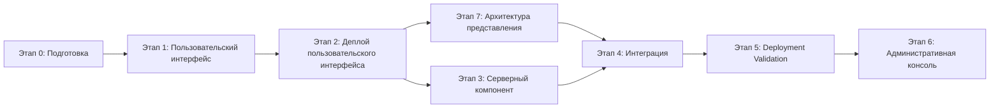

# IMPLEMENTATION_PLAN.md — План реализации первой версии

**Проект:** ai-portfolio
**Версия:** 1.0
**Дата:** 2026-07-12
**Статус:** Завершён в объёме уроков Prompt Engineering. Готов к публикации в Git.

---

## 1. Обзор плана

### Исходные документы (SSOT)

| Документ | Назначение |
|----------|------------|
| `docs/PROJECT_STATE.md` | Решения владельца продукта |
| `docs/SPEC.md` | Продуктовая спецификация |

### Продукт первой версии

Персональный сайт AI-инженера с интегрированным AI-ассистентом.

**Состав:**
- Сайт-портфолио (4 страницы)
- 7 страниц кейсов
- AI-ассистент (интеграция с сайтом)
- База знаний о кейсах и услугах
- Каналы связи (Telegram, Email)

**Не входит:**
- Страница «О себе» (представление на главной)
- Форма обратной связи
- Telegram-бот
- Административная консоль (следующий этап развития)

### Существующая инфраструктура APL

| Ресурс | Описание | Использование |
|--------|----------|---------------|
| **VPS** | Существующий сервер | Деплой проекта |
| **PostgreSQL** | База данных | Основное серверное хранилище проекта |
| **Домены** | Управление доменами | Привязка домена к проекту |
| **GitHub** | Репозитории кейсов | Публикация проекта |
| **Deployment Validation** | Отлаженный процесс | Валидация деплоя |
| **Существующие кейсы** | 7 production-ready проектов | Контент для портфолио |

---

## 2. Этапы реализации

### Диаграмма этапов



---

## 3. Этап 0: Подготовка

**Статус:** ✅ Завершён

### Цель

Подготовить все необходимые материалы для начала разработки: контент, дизайн, базу знаний.

### Результат

| Артефакт | Содержание | Статус |
|----------|------------|--------|
| Тексты главной | Представление владельца, призыв к действию | ✅ |
| Описания кейсов | 7 файлов с описаниями | ✅ |
| Описание услуг | Текст для раздела «Услуги» | ✅ |
| Контакты | Telegram username, Email | ✅ |
| База знаний | JSON-файл для AI-ассистента | ✅ |
| Стилевая концепция | Цвета, шрифты, компоновка | ✅ |

---

## 4. Этап 1: Пользовательский интерфейс

**Статус:** ✅ Завершён (2026-07-13)

### Цель

Реализовать пользовательский интерфейс сайта-портфолио.

### Результат

| Артефакт | Содержание |
|----------|------------|
| Пользовательский интерфейс | 4 страницы + 7 страниц кейсов = 11 страниц |
| Исходный код | `src/` — vanilla HTML/CSS/JS |
| Локальная версия | Работающий сайт на localhost |
| Продакшн версия | Работающий сайт на VPS по адресу https://ai.alex-n8n.site |

### Критерии завершения

- [x] Главная страница отображается корректно
- [x] Все 7 кейсов отображаются в каталоге
- [x] Каждая страница кейса открывается и отображает полную информацию
- [x] Страница «Услуги» отображается
- [x] Страница «Контакты» отображается с рабочими ссылками
- [x] Навигация работает между всеми страницами
- [x] Сайт отображается корректно на desktop и mobile
- [x] Визуальный стиль соответствует инженерному минимализму

---

## 5. Этап 2: Деплой пользовательского интерфейса

**Статус:** ✅ Завершён (2026-07-13)

### Цель

Развернуть пользовательский интерфейс на существующем VPS и обеспечить доступность по домену.

### Результат

| Артефакт | Содержание |
|----------|------------|
| Работающий интерфейс | Сайт доступен по HTTPS |
| Конфигурация сервера | Docker, nginx, Traefik |
| SSL-сертификат | Let's Encrypt |
| Домен | ai.alex-n8n.site настроен и работает |

### Критерии завершения

- [x] Сайт доступен по HTTPS
- [x] Сайт доступен по домену https://ai.alex-n8n.site
- [x] Все страницы открываются без ошибок
- [x] SSL-сертификат валидный

---

## 6. Этап 3: Серверный компонент

**Статус:** ✅ Завершён

### Цель

Реализовать серверный компонент для AI-ассистента, который отвечает на вопросы о кейсах и услугах.

### Этап 3.1: Backend Infrastructure ✅

**Реализовано:**
- Структура backend создана
- FastAPI запускается (порт 8000)
- PostgreSQL подключена (порт 5432)
- Миграции выполнены
- Таблицы: `ai_provider_settings`, `chat_sessions`, `chat_messages`, `operational_logs`
- Начальные данные: OpenAI (active), GigaChat (fallback)
- Docker образ собран

### Этап 3.2.1: Service Layer — Basic Services ✅

**Реализовано:**
- Conversation Memory Service (из Assistant Flow)
- Chat Session Service (из Assistant Flow)
- Operational Log Service (из Review Flow + PEcf09 + Assistant Flow)
- AI Provider Settings Service (из Review Flow)

### Этап 3.2.2: Service Layer — RAG & Cache ✅

**Реализовано:**
- Response Cache (из PEcf09) — кеширование ответов с TTL
- RAG Service (из Assistant Flow + PEcf09) — поиск по базе знаний через ChromaDB
- Knowledge Base Indexer (из PEcf09) — индексация JSON в ChromaDB

### Этап 3.3: REST API & Integration ✅

**Реализовано:**
- Chat Endpoint `POST /chat`
- Health endpoint `GET /health`
- Root endpoint `GET /`
- Интеграция с frontend через `src/js/api-client.js` и `src/js/chat-widget.js`

### Результат

| Артефакт | Содержание | Статус |
|----------|------------|--------|
| Backend Infrastructure | FastAPI + PostgreSQL + миграции | ✅ |
| Service Layer | Memory, Session, Log, Provider, Cache, RAG | ✅ |
| REST API | Chat endpoint, Health endpoint | ✅ |
| UI-компонент | Chat widget на всех страницах | ✅ |
| Интегрированный сайт | Сайт + AI-ассистент работают вместе | ✅ |

### Критерии завершения

- [x] Backend Infrastructure создана
- [x] Basic Services реализованы
- [x] RAG & Cache Services реализованы
- [x] REST API работает (Chat endpoint)
- [x] AI-ассистент отвечает на вопросы о кейсах
- [x] AI-ассистент отвечает на вопросы об услугах
- [x] При недоступности AI — сайт продолжает работать (fallback + error handling)
- [x] API-ключи не доступны публично

---

## 7. Этап 7: Архитектура представления кейсов

**Статус:** ✅ Частично завершён (Lead Qualification реализован как эталон)

### Цель

Привести все существующие кейсы AI Portfolio к архитектуре представления: Narrative Blueprint + Presentation Patterns.

### Результат

| Артефакт | Содержание | Статус |
|----------|------------|--------|
| Narrative Blueprint Lead Qualification | Эталонная реализация | ✅ |
| Страница Lead Qualification | Scene Navigation, Presentation Patterns | ✅ |
| Остальные кейсы | Традиционные страницы с превью | ✅ |

### Примечание

Остальные кейсы (Assistant Flow, Review Flow, HR Assistant, Prompt Review, Telegram AI Gateway, Competitor Monitor AI) используют классические страницы кейсов. Переход на Narrative Blueprint + Scene Navigation является следующим этапом развития контента, но не блокирует текущую публикацию.

---

## 8. Этап 4: Интеграция и тестирование

**Статус:** ✅ Завершён

### Цель

Объединить все компоненты и протестировать работоспособность.

### Результат

| Артефакт | Содержание |
|----------|------------|
| Интегрированный сайт | Сайт + AI-ассистент работают вместе |
| E2E тесты | Проверены пользовательские сценарии |
| README | Описание проекта и способ запуска |

### Критерии завершения

- [x] Все пользовательские сценарии из SPEC работают
- [x] AI-ассистент отвечает корректно
- [x] Сайт доступен 24/7
- [x] При падении AI сайт продолжает работать
- [x] API-ключи не доступны публично

---

## 9. Этап 5: Deployment Validation

**Статус:** ⏳ Следующий этап

### Цель

Подтвердить, что `DEPLOYMENT_GUIDE` позволяет развернуть проект с нуля в чистом окружении.

### Состав работ

| Работа | Описание | Зависит от |
|--------|----------|------------|
| **Чистое окружение** | Подготовка чистого сервера/VM | — |
| **Проход по DEPLOYMENT_GUIDE** | Выполнение инструкций шаг за шагом | Этап 4 |
| **Фиксация проблем** | Документирование несоответствий | — |
| **Исправление DEPLOYMENT_GUIDE** | Актуализация инструкций | — |
| **Повторная валидация** | Повторный проход по исправленному guide | — |
| **Deployment Validation Report** | Отчёт о валидации | — |

### Критерии завершения

- [ ] DEPLOYMENT_GUIDE позволяет развернуть проект с нуля
- [ ] Все шаги DEPLOYMENT_GUIDE выполнены успешно
- [ ] Сайт работает корректно после чистого деплоя
- [ ] AI-ассистент работает корректно после чистого деплоя
- [ ] Deployment Validation Report документирует процесс

---

## 10. Этап 6: Административная консоль

**Статус:** ⏳ Этап развития продукта, не входит в текущий объём

### Цель

Реализовать административную консоль для управления AI Portfolio после завершения Deployment Validation.

### Продуктовая концепция первой версии

Первая версия содержит **только три рабочих пространства**:

| Пространство | Назначение | Границы |
|--------------|------------|---------|
| **Dashboard** | Единая сводная картина состояния AI Portfolio | Только мониторинг, не управление содержимым |
| **Content / Knowledge Base** | Управление карточками проектов, содержимым портфолио, источниками KB, запуск синхронизации | Не редактирует Narrative Blueprint и Presentation Patterns; не является визуальным конструктором страниц |
| **Logs / Conversations** | Operational logs, история обращений, история диалогов, диагностика | — |

### Архитектура Knowledge Base

| Источник | Роль | Source of Truth |
|----------|------|-----------------|
| **GitHub** | Проектная документация | ✅ Да. Основной источник знаний |
| **PostgreSQL** | Управляемые данные сайта, эксплуатация | ✅ Да |
| **ChromaDB** | Векторный поисковый индекс | ❌ Нет. Перестраивается из источников |

**Правила первой версии:**
- GitHub остаётся Source of Truth для проектной документации.
- Административная консоль управляет перечнем подключённых источников и инициирует их синхронизацию вручную.
- Автоматическая синхронизация по webhook не входит в первую версию.
- PostgreSQL не является основным хранилищем проектной документации.

### Narrative Blueprint и Presentation Patterns

- **Narrative Blueprint** отвечает за то, что рассказывает страница проекта, порядок раскрытия материала и драматургию.
- **Presentation Patterns** отвечают за то, как информация отображается пользователю.
- Административная консоль не редактирует ни Narrative Blueprint, ни библиотеку Presentation Patterns.
- Административная консоль работает только с управляемым контентом внутри уже утверждённой структуры.

### Архитектурное решение

Конкретная техническая реализация административной консоли (стек frontend, библиотеки, схемы API, внутренняя архитектура) **не определена на данном этапе**.

Ранее подготовленный черновик технической архитектуры сохранён в `docs/ADMIN_CONSOLE_ARCHITECTURE.md` и будет пересмотрен на этапе проектирования после утверждения настоящего Source of Truth.

### Примечание

Этот этап сознательно не входит в первую публикацию проекта. Он будет реализован после Deployment Validation и подготовки публичного репозитория. Предварительный технический черновик не является окончательным решением.

---

## 11. Сводка по этапам

| Этап | Название | Статус |
|------|----------|--------|
| 0 | Подготовка | ✅ |
| 1 | Пользовательский интерфейс | ✅ |
| 2 | Деплой пользовательского интерфейса | ✅ |
| 7 | Архитектура представления кейсов | ✅ (эталон Lead Qualification) |
| 3 | Серверный компонент | ✅ |
| 4 | Интеграция | ✅ |
| 5 | Deployment Validation | ⏳ |
| 6 | Административная консоль | ⏳ Следующий этап развития |

### Критический путь (завершён)

```
Этап 0 → Этап 1 → Этап 2 → Этап 7 → Этап 4
         ↓
       Этап 3 → Этап 4
```

---

## 12. Риски и зависимости

### Внешние зависимости

| Зависимость | Описание | Митигация |
|-------------|----------|-----------|
| **Контент от владельца** | Тексты для главной, кейсов, услуг | Уже подготовлен |
| **Домен** | Привязка домена к VPS | ai.alex-n8n.site настроен |
| **AI-провайдер API** | API-ключ и доступ | OpenAI + GigaChat fallback |
| **VPS** | Существующая инфраструктура | Проверить ресурсы, конфигурацию |

### Риски проекта

| Риск | Вероятность | Влияние | Митигация |
|------|-------------|---------|-----------|
| Задержка контента от владельца | Низкая | Высокое | Контент подготовлен |
| Качество ответов AI | Средняя | Среднее | Подготовлена база знаний |
| Стоимость API при нагрузке | Низкая | Низкое | Мониторинг использования |
| Проблемы с деплоем | Низкая | Среднее | Deployment Validation |
| Отсутствие изображений кейсов | Средняя | Среднее | Placeholder, запрос у владельца |

---

## 13. Критерии готовности первой версии

### Продуктовые критерии

| Критерий | Признак готовности |
|----------|-------------------|
| Сайт доступен | Работает по HTTPS, все страницы открываются |
| AI-ассистент работает | Отвечает на вопросы о кейсах и услугах |
| Каналы связи работают | Telegram и Email доступны |
| Контент актуален | Все 7 кейсов описаны, услуги описаны |
| Визуальный стиль | Соответствует инженерному минимализму |

### Технические критерии

| Критерий | Признак готовности |
|----------|-------------------|
| Деплой на VPS | Сайт развёрнут на существующем VPS |
| 24/7 доступность | Сайт работает постоянно |
| Fallback AI | При недоступности AI сайт продолжает работать |
| Безопасность | API-ключи не доступны публично |
| Docker-конфигурация | Единый `docker-compose.yml` как Source of Truth, управление через Docker Compose v2 |

### Документационные критерии

| Критерий | Признак готовности |
|----------|-------------------|
| DEPLOYMENT_GUIDE | Позволяет развернуть с нуля |
| Deployment Validation Report | Валидация пройдена |
| README | Описывает проект и способ запуска |

---

## 14. Следующие шаги

1. ~~Согласование плана с владельцем~~ — ✅ Выполнено
2. ~~Этап 0: Подготовка~~ — ✅ Выполнено
3. ~~Этап 1: Пользовательский интерфейс~~ — ✅ Выполнено
4. ~~Этап 2: Деплой пользовательского интерфейса~~ — ✅ Выполнено
5. ~~Этап 3: Серверный компонент~~ — ✅ Выполнено
6. ~~Этап 4: Интеграция~~ — ✅ Выполнено
7. ~~Этап 7: Архитектура представления (эталон Lead Qualification)~~ — ✅ Выполнено
8. **Этап 5: Deployment Validation** — ⏳ Следующий
9. **Этап 6: Административная консоль** — ⏳ Этап развития продукта

---

## История изменений

| Дата | Версия | Изменения |
|------|--------|-----------|
| 2026-07-12 | 1.0 | Первая версия IMPLEMENTATION_PLAN на основе PROJECT_STATE и SPEC |
| 2026-07-12 | 1.1 | Удалены преждевременные архитектурные решения, нейтральные формулировки, уточнено назначение PostgreSQL |
| 2026-07-13 | 1.2 | Отмечено завершение Этапа 1 и Этапа 2 |
| 2026-07-13 | 1.3 | Добавлен этап приведения существующих кейсов к архитектуре представления |
| 2026-07-14 | 1.4 | Добавлены подэтапы Этапа 3: Backend Infrastructure, Basic Services, RAG & Cache. Отмечено их завершение |
| 2026-07-14 | 1.5 | Добавлен Этап 6: Административная консоль |
| 2026-07-15 | 1.6 | Актуализировано состояние: Этапы 3.3, 4 завершены. Уточнено, что административная консоль — следующий этап развития. Проект готов к публикации в Git. |
| 2026-07-15 | 1.7 | В Этапе 6 зафиксирована продуктовая концепция первой версии административной консоли: 3 рабочих пространства, архитектура Knowledge Base, роль Narrative Blueprint / Presentation Patterns. Техническая реализация оставлена для этапа проектирования. |
