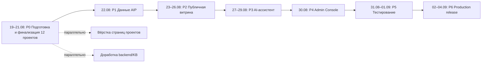

# IMPLEMENTATION_PLAN.md — AI Portfolio: финальная реализация

**Проект:** ai-portfolio  
**Версия:** 3.3  
**Дата:** 2026-08-25  
**Статус:** Утверждено  
**Целевой период:** 19.08.2026 — 04.09.2026 (17 календарных дней)  
**Целевая дата production-ready release:** 04.09.2026  

---

## 1. Обзор плана

### 1.1 Исходные документы (SOT)

| Документ | Назначение |
|----------|------------|
| [`docs/TZ.md`](TZ.md) | Техническое задание v1.5 — scope, MoSCoW, критерии приёмки |
| [`docs/PROJECT_STATE.md`](PROJECT_STATE.md) | Состояние проекта и принятые/ожидающие решения |
| [`docs/ARCHITECTURE.md`](ARCHITECTURE.md) | Архитектура и технический стек |
| [`docs/DEPLOYMENT_GUIDE.md`](DEPLOYMENT_GUIDE.md) | Процесс развёртывания |
| [`docs/PORTFOLIO_CORPUS_AUDIT.md`](PORTFOLIO_CORPUS_AUDIT.md) | Матрица технического долга, интеграции и NEW GAP |
| [`docs/PEf05_RATING.md`](PEf05_RATING.md) | Ретроспективный рейтинг 13 кандидатов + рейтинг 12 проектов в портфеле |
| [`reports/2026-08-18_rep-zerocoder-half-year-finalization.md`](../../reports/2026-08-18_rep-zerocoder-half-year-finalization.md) | Исходный baseline технического долга 12 проектов |

### 1.2 Что охватывает этот план

План включает **две связанные работы**:

1. **Разовая финализация 12 портфельных проектов** перед первым запуском AI Portfolio — полный EXISTING DEBT из `PORTFOLIO_CORPUS_AUDIT`, разложенный по конкретным работам, категориям, зависимостям и датам.
2. **Доведение самого AI Portfolio** до production-ready состояния: данные, публичная витрина, AI-ассистент, Admin Console, тестирование, production release.

После запуска добавление/актуализация отдельных проектов становится самостоятельным эксплуатационным процессом.

### 1.3 Что уже реализовано (as-is)

- Публичный frontend на vanilla HTML/CSS/JS (`src/`).
- Backend на FastAPI + PostgreSQL + ChromaDB HTTP (`backend/`).
- Admin Console v1 на React + TypeScript + Vite (`admin/`), 5 разделов навигации.
- `ProjectCard` в PostgreSQL как SOT карточек проектов.
- GitHub Sync: 7 источников, 192 документа, ~5400 чанков.
- Multi-provider LLM: OpenAI active + GigaChat fallback, параметры в БД.
- Execution tracing и operational logs.
- Продакшн-деплой на VPS: `https://ai.alex-n8n.site`.

### 1.4 Что нужно доделать (delta)

- **Финализировать 12 проектов:** декомпозировать и выполнить EXISTING DEBT по каждому проекту; подготовить AIP INTEGRATION; закрыть NEW GAP.
- Актуализировать `ProjectCard` под 13 управляемых карточек: 12 готовых проектов + placeholder Prompt Review.
- Расширить GitHub Sync на все 12 проектов + собственный корпус AI Portfolio.
- Перестроить ChromaDB по актуальному корпусу.
- Обновить публичный frontend: главная dual-theme страница, каталог, 12 страниц проектов (Prompt Review отображается как placeholder). Страницы кейсов выполняются по принятому шаблону `AIP Case Landing Page Standard v1.1`; эталонная реализация — AI Curator (`/cases/ai-curator-template-preview.html`).
- Настроить AI-ассистента на новый корпус; контрольный набор вопросов; eval ≥90% / <5 сек.
- Добавить в Admin Console управление presale-событиями и базовую presale-аналитику.
- Пройти production release на VPS к 04.09.2026.

---

## 2. Целевой состав портфеля

| # | Проект | Роль в портфеле | GitHub / Demo / Landing |
|---|--------|-----------------|------------------------|
| 1 | Review Auto Responder | Готовый кейс с live-demo | `review-auto-responder` / demo |
| 2 | AI Curator | Готовый кейс с live-demo | `ai-curator` / demo |
| 3 | AI Data Assistant | Готовый кейс (Docker E2E) | `ai-data-assistant` / GitHub |
| 4 | Assistant Flow | Кейс с операционным долгом | `assistant-flow` / GitHub |
| 5 | Meeting Audit Bot | Готовый кейс с live-demo | `meeting-audit-bot` / demo |
| 6 | Lead Qualification | Готовый кейс с live-demo | `n8n-lead-qualification` / demo |
| 7 | HR Assistant | Кейс с критическим ML-дефектом | `hr-assistant` / landing |
| 8 | HRA-LoRA | Эксперимент / landing | `hr-assistant/finetuning` / landing |
| 9 | Telegram Intake Bot | MVP, live-demo после Deployment Validation* | `telegram-intake-bot` / demo* |
| 10 | Telegram Onboarding Bot | MVP, live-demo после Deployment Validation* | `telegram-onboarding-bot` / demo* |
| 11 | Review Flow | Live-demo, требует повторной Validation* | `review-flow` / demo |
| 12 | Retail Group | Пресейл-кейс / Case Story | `retail-group` / landing |

### 2.1 Управляемая карточка-анонс

| # | Псевдо-проект | Роль в портфеле | GitHub / Demo / Landing |
|---|---------------|-----------------|------------------------|
| 13 | Prompt Review | Карточка-анонс будущего проекта / placeholder | — |

Prompt Review **не является тринадцатым завершённым проектом**. Он отображается как placeholder-карточка в публичной витрине, чтобы сохранить чёткое сообщение: в портфеле **12 готовых проектов** и один анонс.

\* Deployment Validation откладывается по решению владельца. Проекты включаются в портфель с текущими demo/GitHub-ссылками, повторная валидация планируется отдельно.

---

## 3. Декомпозиция EXISTING DEBT + AIP INTEGRATION + NEW GAP

Полная матрица по проектам — в [`docs/PORTFOLIO_CORPUS_AUDIT.md`](PORTFOLIO_CORPUS_AUDIT.md). Ниже — календарная декомпозиция всех работ.

### Категории

- **A. EXISTING DEBT** — технический долг, зафиксированный в `PORTFOLIO_CORPUS_AUDIT` и отчёте 18.08.
- **B. AIP INTEGRATION** — работы, необходимые для включения проекта в AI Portfolio.
- **C. NEW GAP** — новая критическая фактическая проблема, не присутствующая в baseline.

### 3.1. Review Auto Responder

| # | Работа | Кат | Зависимость | Дата | Результат |
|---|--------|-----|-------------|------|-----------|
| 1 | CA-bundle GigaChat: заменить `ssl.CERT_NONE` на корректный CA-bundle | A | — | 19.08 | GigaChat fallback работает без отключения верификации |
| 2 | Batch execution tracing: схлопнуть execution-tracing в один `create-with-steps` POST при росте объёмов | A | — | 20.08 | Уменьшено количество tracing-запросов; логи не теряются |
| 3 | Подготовить карточку проекта (ProjectCard) | B | — | 19.08 | Актуальная запись в PostgreSQL |
| 4 | Создать/актуализировать страницу проекта в `src/` | B | #3 | 24.08 | HTML-страница с задачей, решением, архитектурой, результатами, ссылками |
| 5 | Проверить GitHub/demo-ссылки | B | — | 21.08 | 0 битых ссылок |
| 6 | Добавить репозиторий в GitHub Sync | B | #5 | 22.08 | KB-источник подключён |

### 3.2. AI Curator

| # | Работа | Кат | Зависимость | Дата | Результат |
|---|--------|-----|-------------|------|-----------|
| 1 | Roadmap UI KB: публикация/снятие с публикации, удаление/архивирование документов, Git-метаданные версий в Admin Console | A | — | 20.08–21.08 | Раздел Knowledge Base в Admin Console показывает статусы документов |
| 2 | GIF walkthrough (опциональный элемент публичной документации) | A | — | 23.08 | GIF-демонстрация в README или на лендинге |
| 3 | Подготовить карточку проекта | B | — | 19.08 | Актуальная ProjectCard |
| 4 | Создать/актуализировать страницу проекта | B | #3 | 24.08 | HTML-страница с описанием, архитектурой, ссылками |
| 5 | Проверить GitHub/demo-ссылки | B | — | 21.08 | 0 битых ссылок |
| 6 | Добавить репозиторий в GitHub Sync | B | #5 | 22.08 | KB-источник подключён |

### 3.3. AI Data Assistant

| # | Работа | Кат | Зависимость | Дата | Результат |
|---|--------|-----|-------------|------|-----------|
| 1 | Вариант 4: декларативный движок графиков (chart spec как данные) | A | — | 20.08–22.08 | Поддержка chart spec; ассистент генерирует графики по декларативной спецификации |
| 2 | Вынести `ACTION_TYPES`, `CHART_TYPES` из хардкода в редактируемые runtime-параметры админки | A | #1 | 23.08 | Администратор может менять реестры без деплоя |
| 3 | Аутентификация пользователей чата | A | — | 24.08–25.08 | Чат защищён, сессии разделены |
| 4 | Persistent volume для `storage/` в production | A | — | 23.08 | Данные `storage/` не теряются при пересоздании контейнера |
| 5 | Подготовить карточку проекта | B | — | 19.08 | Актуальная ProjectCard |
| 6 | Создать/актуализировать страницу проекта | B | #5 | 25.08 | HTML-страница с GitHub, Docker E2E, ссылками на docs |
| 7 | Проверить GitHub-ссылки | B | — | 21.08 | 0 битых ссылок |
| 8 | Добавить репозиторий в GitHub Sync | B | #7 | 22.08 | KB-источник подключён |

### 3.4. Assistant Flow

| # | Работа | Кат | Зависимость | Дата | Результат |
|---|--------|-----|-------------|------|-----------|
| 1 | RAG operational UI polish: сохранение полной инспекции чанков | A | — | 20.08 | UI показывает источники чанков |
| 2 | Telemetry/economy audit: input/output/total/embedding tokens, provider/model normalization | A | #1 | 21.08–22.08 | Все токены нормализованы и видны в UI |
| 3 | Multi-version document architecture: PostgreSQL historical versions/chunks, Chroma active versions only, idempotent reindexing | A | #2 | 23.08–25.08 | Reindex не дублирует векторы; жизненный цикл версий согласован |
| 4 | Стабилизация heavy RAG: решить проблему RAM/synchronous pipeline VPS | A | #3 | 26.08–27.08 | Большие документы не падают/не зависают после reindex |
| 5 | RBAC/auth на Admin API | A | — | 24.08–25.08 | Admin API защищён ролями |
| 6 | Async/background processing layer | A | #5 | 26.08–28.08 | Долгие операции уходят в фон |
| 7 | Production build для React Admin UI | A | — | 23.08 | Собран production bundle |
| 8 | Привести PROJECT_STATE к стандарту APL, создать/актуализировать единый SPEC | A | — | 19.08–20.08 | PROJECT_STATE и SPEC соответствуют шаблону APL |
| 9 | Подготовить карточку проекта | B | — | 19.08 | Актуальная ProjectCard |
| 10 | Создать/актуализировать страницу проекта | B | #9 | 25.08 | HTML-страница с описанием платформы, GitHub, скриншотами |
| 11 | Проверить GitHub-ссылки | B | — | 21.08 | 0 битых ссылок |
| 12 | Добавить репозиторий в GitHub Sync | B | #11 | 22.08 | KB-источник подключён |

### 3.5. Meeting Audit Bot

| # | Работа | Кат | Зависимость | Дата | Результат |
|---|--------|-----|-------------|------|-----------|
| 1 | Добавить before/after пример ответа модели для одного сценария | A | — | 20.08 | В docs или на странице проекта есть сравнение |
| 2 | Эвристика качества транскрибации | A | — | 21.08–22.08 | Оценка качества аудио/транскрибации до отправки в LLM |
| 3 | Автотесты на формат ответа LLM | A | — | 23.08 | Тесты проверяют структуру JSON-ответа |
| 4 | Webhook-режим Telegram вместо polling | A | — | 24.08–25.08 | Бот работает через webhook |
| 5 | Версионирование промптов и rollback | A | — | 26.08–27.08 | Промпты версионируются; можно откатиться |
| 6 | Подготовить карточку проекта | B | — | 19.08 | Актуальная ProjectCard |
| 7 | Создать/актуализировать страницу проекта | B | #6 | 24.08 | HTML-страница с before/after, архитектурой, ссылками |
| 8 | Проверить GitHub/demo-ссылки | B | — | 21.08 | 0 битых ссылок |
| 9 | Добавить репозиторий в GitHub Sync | B | #8 | 22.08 | KB-источник подключён |

### 3.6. Lead Qualification

| # | Работа | Кат | Зависимость | Дата | Результат |
|---|--------|-----|-------------|------|-----------|
| 1 | Event chaining: мгновенная классификация вместо 5-минутного polling | A | — | 20.08–22.08 | Сценарий n8n реагирует на событие, а не на polling |
| 2 | Bitrix24 Integration | A | #1 | 23.08–25.08 | Подключена интеграция с Bitrix24 |
| 3 | Multi-language support | A | — | 24.08–25.08 | Поддержка нескольких языков в классификации |
| 4 | Semantic Fallback: embeddings вместо keyword matching | A | — | 26.08–28.08 | Fallback на семантический поиск |
| 5 | Чат-бот-диалог с моделью; сократить разветвление Telegram-воркфлоу за счёт сабворкфлоу | A | #4 | 26.08–29.08 | Упрощённая структура workflow |
| 6 | Подготовить карточку проекта | B | — | 19.08 | Актуальная ProjectCard |
| 7 | Создать/актуализировать страницу проекта | B | #6 | 24.08 | HTML-страница с GitHub, demo, схемой workflow |
| 8 | Проверить GitHub/demo-ссылки | B | — | 21.08 | 0 битых ссылок |
| 9 | Добавить репозиторий в GitHub Sync | B | #8 | 22.08 | KB-источник подключён |

### 3.7. HR Assistant

| # | Работа | Кат | Зависимость | Дата | Результат |
|---|--------|-----|-------------|------|-----------|
| 1 | **KP-001 metadata**: исправить заполнение `metadata` в `outbox` в Processing Worker | A | — | 19.08–20.08 | TTS и visual generation используют реальные данные |
| 2 | Hard-negative dataset fix: ре-разметить hard negatives | A | #1 | 21.08–23.08 | Датасет скорректирован |
| 3 | Production smoke set 30–50 кейсов, stratified metrics | A | #2 | 24.08–26.08 | Готовый smoke set и метрики по стратам |
| 4 | Score calibration (MAE 19.6 → ближе к 6.2) | A | #3 | 27.08–29.08 | Калибровка score |
| 5 | Latency optimization (vLLM/TGI, quantization) | A | #4 | 30.08–01.09 | Уменьшена latency |
| 6 | Перенос credentials в environment variables | A | — | 20.08 | Секреты не в коде |
| 7 | Подготовить карточку проекта | B | — | 19.08 | Актуальная ProjectCard |
| 8 | Создать/актуализировать страницу проекта | B | #7 | 25.08 | HTML-страница с landing, ML-метриками, GitHub |
| 9 | Проверить GitHub/landing-ссылки | B | — | 21.08 | 0 битых ссылок |
| 10 | Добавить репозиторий в GitHub Sync | B | #9 | 22.08 | KB-источник подключён |

### 3.8. HRA-LoRA

| # | Работа | Кат | Зависимость | Дата | Результат |
|---|--------|-----|-------------|------|-----------|
| 1 | Hard-negative dataset fix по жёстким критериям | A | — | 21.08–23.08 | Датасет скорректирован |
| 2 | Production smoke set 30–50 кейсов, stratified metrics | A | #1 | 24.08–26.08 | Готовый smoke set и метрики |
| 3 | Score calibration (MAE 19.6 → ближе к 6.2) | A | #2 | 27.08–29.08 | Калибровка score |
| 4 | Latency optimization (vLLM/TGI, quantization, QLoRA / larger base model) | A | #3 | 30.08–02.09 | Уменьшена latency |
| 5 | Управленческое оформление: on-premise/edge продукт или явный подпродукт HR Assistant | A | #4 | 01.09–03.09 | Позиционирование зафиксировано в docs |
| 6 | Подготовить карточку проекта | B | — | 19.08 | Актуальная ProjectCard |
| 7 | Создать/актуализировать страницу проекта | B | #6 | 25.08 | HTML-страница с landing, экспериментом, позиционированием |
| 8 | Проверить landing-ссылки | B | — | 21.08 | 0 битых ссылок |
| 9 | Добавить репозиторий в GitHub Sync | B | #8 | 22.08 | KB-источник подключён |

### 3.9. Telegram Intake Bot

| # | Работа | Кат | Зависимость | Дата | Результат |
|---|--------|-----|-------------|------|-----------|
| 1 | **Deployment Validation на VPS** | A | — | 19.08–21.08 | Отчёт Deployment Validation (отложена по решению владельца) |
| 2 | Упростить тексты промптов и сообщений бота | A | — | 22.08 | Промпты и сообщения упрощены |
| 3 | Вынести логику выбора сценария в `services/scenario_router.py` | A | #2 | 23.08 | Отдельный модуль маршрутизации сценариев |
| 4 | Заложить интерфейс внешнего хранилища сессий (PostgreSQL/Redis) | A | — | 24.08–25.08 | Интерфейс хранилища готов, миграции/код |
| 5 | Обновить скриншоты до отдельных кадров v2 | A | — | 23.08 | Скриншоты актуальные |
| 6 | Подготовить карточку проекта | B | — | 19.08 | Актуальная ProjectCard |
| 7 | Создать/актуализировать страницу проекта | B | #6 | 24.08 | HTML-страница с Telegram-ботом, GitHub, скриншотами |
| 8 | Проверить GitHub/demo-ссылки | B | — | 21.08 | 0 битых ссылок |
| 9 | Добавить репозиторий в GitHub Sync | B | #8 | 22.08 | KB-источник подключён |

### 3.10. Telegram Onboarding Bot

| # | Работа | Кат | Зависимость | Дата | Результат |
|---|--------|-----|-------------|------|-----------|
| 1 | **Deployment Validation в чистом окружении** | A | — | 19.08–21.08 | Отчёт Deployment Validation (отложена по решению владельца) |
| 2 | Retry/fallback при недоступности OpenAI API (429/5xx) | A | — | 22.08–23.08 | Бот переключается на fallback при сбоях |
| 3 | Персистентное FSM-хранилище (Redis/PostgreSQL) вместо `MemoryStorage` | A | #2 | 24.08–25.08 | Состояния не теряются при перезапуске |
| 4 | RBAC на `/topic <id>`: только авторизованный пользователь меняет глобальную тему | A | — | 24.08 | Проверка прав перед сменой темы |
| 5 | Команда `/edit_topic` для тем без файла-заготовки | A | #4 | 25.08–26.08 | Редактирование темы inline |
| 6 | Подготовить карточку проекта | B | — | 19.08 | Актуальная ProjectCard |
| 7 | Создать/актуализировать страницу проекта | B | #6 | 24.08 | HTML-страница с Telegram-ботом, GitHub, скриншотами |
| 8 | Проверить GitHub/demo-ссылки | B | — | 21.08 | 0 битых ссылок |
| 9 | Добавить репозиторий в GitHub Sync | B | #8 | 22.08 | KB-источник подключён |

### 3.11. Review Flow

| # | Работа | Кат | Зависимость | Дата | Результат |
|---|--------|-----|-------------|------|-----------|
| 1 | **Повторное прохождение Deployment Validation** с новыми ops-токенами и demo-лимитером | A | — | 19.08–21.08 | Отчёт Deployment Validation (отложена по решению владельца) |
| 2 | Модуль интеграции с Kommo CRM | A | #1 | 22.08–24.08 | Интеграция реализована |
| 3 | Модуль интеграции с Bitrix24 | A | #2 | 25.08–27.08 | Интеграция реализована |
| 4 | Адаптация pipeline для работы с n8n | A | #3 | 28.08–29.08 | n8n-нода или webhook готовы |
| 5 | Упростить Controlled Hybrid для не-инженерной аудитории | A | — | 23.08–25.08 | Архитектура описана понятно для заказчика |
| 6 | Подготовить карточку проекта | B | — | 19.08 | Актуальная ProjectCard |
| 7 | Создать/актуализировать страницу проекта | B | #6 | 25.08 | HTML-страница с упрощённой архитектурой, GitHub, demo |
| 8 | Проверить GitHub/demo-ссылки | B | — | 21.08 | 0 битых ссылок |
| 9 | Добавить репозиторий в GitHub Sync | B | #8 | 22.08 | KB-источник подключён |

### 3.12. Retail Group

| # | Работа | Кат | Зависимость | Дата | Результат |
|---|--------|-----|-------------|------|-----------|
| 1 | Завершить сборку Retail Group Case Story (32 слайда) | A | — | 20.08–23.08 | Готовая Case Story |
| 2 | Проверить, что Case Story не выдаёт гипотезы за факты | A | #1 | 24.08 | Все факты верифицированы |
| 3 | Внутренний review и решение о публикации | A | #2 | 25.08 | Решение зафиксировано |
| 4 | Добавить реальную компанию из открытых источников, KPI демо-пилота, примеры промптов классификатора, нематериальные эффекты, риски пилота, методологию оценки точности, сезонность/пики, примеры критических ошибок | A | #3 | 26.08–29.08 | Усиленная Case Story |
| 5 | Подготовить карточку проекта | B | — | 19.08 | Актуальная ProjectCard |
| 6 | Создать/актуализировать страницу проекта | B | #5 | 25.08 | HTML-страница с Case Story, пресейл-материалами |
| 7 | Проверить GitHub/landing-ссылки | B | — | 21.08 | 0 битых ссылок |
| 8 | Добавить репозиторий в GitHub Sync | B | #7 | 22.08 | KB-источник подключён |

### 3.13. AI Portfolio (собственные работы)

| # | Работа | Кат | Зависимость | Дата | Результат |
|---|--------|-----|-------------|------|-----------|
| 1 | Сузить позиционирование/обозначить отрасли | A | — | 19.08 | Обновленное позиционирование в README/docs |
| 2 | Добавить before/after метрики на страницы кейсов | A | — | 24.08–26.08 | На страницах кейсов есть метрики «до/после» |
| 3 | Подсветить бизнес-метрики рядом с ассистентом | A | — | 27.08 | Блок бизнес-метрик в UI |
| 4 | Экспорт логов (CSV/API) + политика ротации | A | — | 30.08–31.08 | Администратор может экспортировать логи |
| 5 | **Deployment Validation AI Portfolio** | A | — | 02.09–04.09 | Отчёт Deployment Validation (отложена по решению владельца) |
| 6 | Актуализировать `ProjectCard` под 13 управляемых карточек | B | 3.1–3.12 #3 | 22.08 | 13 карточек в PostgreSQL: 12 проектов + Prompt Review placeholder |
| 7 | Расширить GitHub Sync на 12+1 источников | B | 3.1–3.12 #9 | 22.08 | Все KB-источники подключены |
| 8 | Перестроить ChromaDB | B | #7 | 22.08 | Актуальный индекс |
| 9 | Обновить публичный frontend | B | #6 | 23.08–26.08 | Главная dual-theme страница, каталог, 12 страниц проектов, услуги, контакты; Prompt Review рендерится как placeholder; страницы кейсов выполняются по `AIP Case Landing Page Standard v1.1` (эталон — AI Curator) |
| 10 | Настроить AI-ассистента на новый корпус | B | #8, #9 | 27.08–29.08 | Eval ≥90%, latency <5 сек |
| 11 | Presale-события и базовая presale-аналитика в Admin Console | B | — | 30.08 | Воронка в Admin Console |
| 12 | Production release на VPS | B | #5, #10, #11 | 02.09–04.09 | Сайт доступен по HTTPS |

---

## 4. Календарный план — 19.08.2026 → 04.09.2026

### 4.1. Сводная диаграмма потоков

### 4.2. Фазы

| Фаза | Даты | Потоки | Результат | Критерий завершения |
|------|------|--------|-----------|---------------------|
| **P0. Подготовка и финализация 12 проектов** | 19.08–21.08 | SOT-документы; реестр; проверка ссылок; старт EXISTING DEBT по всем 12 проектам; NEW GAP #1/#2 | Согласованные черновики TZ/IMP/PROJECT_STATE; реестр `projects_registry.json`; проверенные ссылки; запущенная финализация проектов | Все SOT-документы на согласовании; реестр 12 проектов подтверждён; битых ссылок нет или есть placeholder |
| **P1. Данные AI Portfolio** | 22.08 | Актуализация ProjectCard; GitHub Sync 12+1; ChromaDB reindex | 13 карточек (`ProjectCard`); индексированный корпус KB | `GET /project-cards` = 13 (12 проектов + Prompt Review placeholder); ChromaDB содержит 12+1 источников; sync без ошибок |
| **P2. Публичная витрина** | 23.08–26.08 | Главная dual-theme страница, каталог, 12 страниц проектов, услуги, контакты; параллельно — доработки EXISTING DEBT | Полностью работающий сайт с 12 проектами + Prompt Review placeholder | Главная и каталог открываются; 12 страниц проектов доступны; страницы кейсов соответствуют `AIP Case Landing Page Standard v1.1` (эталон — AI Curator); 0 битых ссылок; presale-путь проходим |
| **P3. AI-ассистент** | 27.08–29.08 | Обновление промпта; ретривал; fallback; eval | AI-ассистент ≥90% / <5 сек с источниками | Eval ≥90%; latency <5 сек; fallback работает |
| **P4. Admin Console** | 30.08 | Presale-события; presale-аналитика; управление проектами/KB; sync status | Admin Console покрывает Must Have и базовые Should Have | CRUD проектов; sync KB; воронка presale-пути |
| **P5. Тестирование** | 31.08–01.09 | Функциональные, E2E, AI eval, ссылки, presale-путь, security, graceful degradation | Отчёт тестирования; 0 критических дефектов | Все тесты PASS |
| **P6. Production release** | 02.09–04.09 | Миграции; seed; deploy; HTTPS; health checks; backup; финальный E2E | AI Portfolio доступен по HTTPS и работает | Сайт доступен; 12 проектов + Prompt Review placeholder на месте; ассистент отвечает |

### 4.3. Параллельные потоки

- **Поток «Проекты»:** EXISTING DEBT выполняется параллельно для всех 12 проектов на протяжении P0–P4. Каждый проект — независимая дорожка, если его работы не зависят от общих компонентов AIP.
- **Поток «AIP backend/data»:** P1, P4, часть P3 — зависит от завершения интеграционных работ по проектам (ссылки, KB-источники).
- **Поток «AIP frontend»:** P2 — зависит от ProjectCard и контента от проектов, но вёрстка может начинаться сразу после P1.
- **Поток «AIP AI/RAG»:** P3 — зависит от P1 (корпус KB) и P2 (страницы как источники ответов).

### 4.4. Критический путь

1. **P0** — согласование SOT и запуск финализации (19.08–21.08).
2. **P1** — данные AIP (22.08).
3. **P2** — публичная витрина (23.08–26.08).
4. **P3** — AI-ассистент (27.08–29.08).
5. **P4** — Admin Console (30.08).
6. **P5** — тестирование (31.08–01.09).
7. **P6** — production release (02.09–04.09).

**Длиннейшие независимые цепочки по проектам:**
- Assistant Flow: multi-version + heavy RAG stabilization — до 28.08.
- HR Assistant: KP-001 + smoke set + calibration + latency — до 01.09.
- HRA-LoRA: smoke set + calibration + latency + positioning — до 03.09.
- Lead Qualification: event chaining → Bitrix24 → semantic fallback → chat dialog — до 29.08.
- Review Flow: Controlled Hybrid simplification + Kommo + Bitrix24 + n8n — до 29.08.

Эти цепочки **параллельны** и могут не лечь на критический путь AIP, но требуют ресурса.

---

## 5. DEFER CANDIDATE

**На старте реализации DEFER CANDIDATE не утверждаются.**

Полный scope выполняется по настоящему плану до 04.09.2026.

Если в ходе реализации конкретная работа реально угрожает сроку, применяется последовательность:
1. Перепланирование.
2. Параллельное выполнение независимых работ.
3. Проверка зависимостей и критического пути.

Только если этого недостаточно, оформляется отдельный DEFER CANDIDATE с указанием:

- проект / функция;
- конкретная работа;
- причина переноса;
- влияние на итоговый результат;
- влияние на критерии приёмки;
- оценка выигрыша по сроку;
- почему release остаётся допустимым без этой работы.

**Решение о переносе принимает только владелец проекта.**

---

## 6. MoSCoW mapping

| Требование | MoSCoW | Фаза |
|------------|--------|------|
| Разовая финализация 12 проектов | Must | P0–P4 |
| Единая публичная витрина: 12 проектов + Prompt Review placeholder | Must | P2 |
| Страница проекта | Must | P2 |
| Прямые ссылки на GitHub/demo/landing | Must | P2 |
| AI-ассистент с grounded-ответами | Must | P3 |
| Управление публичным содержимым | Must | P4 |
| Управление базой знаний | Must | P4 |
| Измерение presale-пути | Must | P4 |
| Автоматическая синхронизация GitHub | Should | P4 (базовый schedule) |
| Визуальная presale-аналитика | Should | P4 |
| Сохранение истории диалога | Should | P4 (visitor_id continuity) |
| Расширенная аналитика | Could | post-MVP |
| Сохранение резюме диалога | Could | post-MVP |

---

## 7. Риски и митигация

| Риск | Вероятность | Влияние | Митигация |
|------|-------------|---------|-----------|
| Финализация 12 проектов занимает больше ресурса, чем позволяет 17-дневный срок | Средняя | Высокое | Параллельные потоки; ежедневный статус; DEFER CANDIDATE по проектам |
| ChromaDB reindex занимает больше времени | Средняя | Среднее | Запускать ночью; инкрементальная sync при наличии |
| LLM eval не дотягивает до 90% | Средняя | Высокое | Докрутка промпта, rerank, фильтрация чанков; fallback на более сильную модель |
| Сломаны ссылки на demo/GitHub | Высокая | Среднее | Автопроверка ссылок; placeholder-страницы для отложенных demo |
| Frontend-страницы требуют много ручной вёрстки | Средняя | Среднее | Единый layout; параметризация через JSON |
| Не успеть к 04.09.2026 | Средняя | Высокое | Жёсткий приоритет Must; DEFER CANDIDATE; ежедневный статус |
| ML-контур HR Assistant/HRA-LoRA затягивается | Средняя | Высокое | Закрыть KP-001 в первую очередь; остальное — DEFER CANDIDATE |

---

## 8. Критерии готовности этапов

| Фаза | Критерий |
|------|----------|
| P0 | SOT-документы на согласовании; реестр 12 проектов проверен; финализация проектов запущена |
| P1 | 13 ProjectCard (12 проектов + Prompt Review placeholder), 12+1 источников GitHub, ChromaDB reindex завершён |
| P2 | Главная dual-theme страница и каталог работают; 12 страниц проектов открываются; ссылки работают; presale-путь проходим |
| P3 | Eval ≥90%, latency <5 сек, fallback работает |
| P4 | Admin Console покрывает CRUD проектов, sync KB, presale-аналитику |
| P5 | Все тесты PASS, дефекты не блокируют приёмку |
| P6 | Production deploy, health checks OK, финальный E2E PASS |

---

## 9. Зависимости и внешние ресурсы

| Ресурс | Назначение | Статус |
|--------|-----------|--------|
| VPS | Production deploy | Доступен |
| Домен `ai.alex-n8n.site` | Публичный доступ | Настроен |
| PostgreSQL | ProjectCard, logs, sessions | Развёрнут |
| ChromaDB HTTP | Векторный индекс | Развёрнут как `ai-portfolio-chroma` |
| OpenAI API | Основной LLM | Ключ в `.env` |
| GigaChat API | Fallback LLM | Ключ в `.env` |
| GitHub API | Синхронизация KB | Токен в `.env` |
| Traefik + Let's Encrypt | HTTPS | Настроен |

---

## 10. Артефакты, создаваемые в рамках плана

| Артефакт | Расположение |
|----------|--------------|
| `docs/TZ.md` | Техническое задание |
| `docs/IMPLEMENTATION_PLAN.md` | Настоящий документ |
| `docs/PROJECT_STATE.md` | Обновлённое состояние |
| `docs/AI_EVAL_REPORT.md` | Результаты eval AI-ассистента |
| `docs/PORTFOLIO_CORPUS_AUDIT.md` | Аудит корпуса и матрица финализации |
| `docs/PEf05_RATING.md` | Рейтинг 13 кандидатов + 12 проектов в портфеле |
| `backend/data/projects_registry.json` | Реестр 12 проектов |
| `backend/tests/ai_portfolio_eval_set.json` | Контрольный набор вопросов |

---

## 11. История изменений

| Дата | Версия | Изменения |
|------|--------|-----------|
| 2026-07-12 | 1.0 | Базовый IMPLEMENTATION_PLAN для первой версии AI Portfolio |
| 2026-08-18 | 2.0 | 10-дневный план финализации AI Portfolio |
| 2026-08-18 | 3.0 (черновик) | 17-дневный план 19.08–04.09.2026 с разовой финализацией 12 проектов |
| 2026-08-18 | 3.1 | Полная декомпозиция EXISTING DEBT + AIP INTEGRATION + NEW GAP по 12 проектам; параллельные потоки; DEFER CANDIDATE только по решению владельца; убраны несогласованные отсрочки; статус «Утверждено» |
| 2026-08-25 | 3.2 | Корректировка после интеграции dual-theme главной страницы: 13 управляемых карточек (12 проектов + Prompt Review placeholder), актуализация ссылок на TZ v1.4 / SPEC v2.1, разделение завершённой P1/P2 и незавершённой P2-расширения/AI-ассистента/Morphic. |
| 2026-08-25 | 3.3 | Зафиксирован принятый шаблон лендинга кейса (`AIP Case Landing Page Standard v1.1`, эталон — AI Curator): уточнены delta, работа #9 публичного frontend и критерий завершения P2; актуализированы ссылки на TZ v1.5 / SPEC v2.2 |
