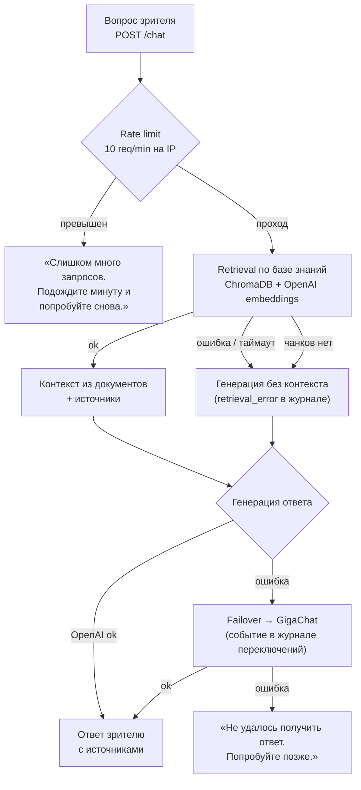

# 🔧 OPERATIONS — эксплуатация развёрнутого экземпляра

**Основной читатель:** оператор живого production-экземпляра AI Portfolio (VPS, Docker Compose).
**Назначение:** штатные операции и реагирование на инциденты для уже развёрнутой системы. Развёртывание с нуля — [`docs/DEPLOYMENT_GUIDE.md`](DEPLOYMENT_GUIDE.md); повседневная работа в Admin Console — [`docs/ADMIN_GUIDE.md`](ADMIN_GUIDE.md).

> 📌 **SOT:** операции описаны по фактической конфигурации репозитория (compose, backend, Admin Console). Расхождение с кодом исправляется в документации.

---

## 🗺️ 1. Карта эксплуатации

| Задача | Документ |
|--------|----------|
| Развернуть систему с нуля | [`docs/DEPLOYMENT_GUIDE.md`](DEPLOYMENT_GUIDE.md) |
| Работать в консоли (KB, промпт, карточки) | [`docs/ADMIN_GUIDE.md`](ADMIN_GUIDE.md) |
| Проверить контракт API | [`docs/API_CONTRACT.md`](API_CONTRACT.md) |
| Смена активного промпта (архитектура) | [`docs/PROMPT_ARCHITECTURE.md`](PROMPT_ARCHITECTURE.md) |
| Проверить качество ответов | [`docs/AI_EVAL_REPORT.md`](AI_EVAL_REPORT.md) |

Состав сервисов Compose (все с healthcheck): `ai-portfolio-postgres`, `ai-portfolio-backend`, `ai-portfolio-frontend`, `ai-portfolio-chroma` (активный векторный бэкенд), `ai-portfolio-weaviate` (резервный).

---

## ✅ 2. Регламентные проверки

### Ежедневно (1–2 минуты)

```bash
docker compose ps                       # пять сервисов, статус healthy
curl -s https://ai.alex-n8n.site/health # {"status":"ok",…}
```

- **Система → Обзор** в Admin Console — бэкенды (PostgreSQL, векторный стор, LLM-провайдеры), объём KB, Last Sync.
- Контрольный вопрос ассистенту на сайте — ответ со источниками за ожидаемое время (p50 ≈ 2,4 с).

### Еженедельно

- **Наблюдаемость → Логи** — execution-сессии чата: рост ошибок, рост latency.
- **Аналитика → Пресейл** — воронка и аномалии трафика.
- Резервная копия PostgreSQL (§5).

---

## 🔄 3. Штатные операции

### 3.1. Обновление кода

```bash
git pull                                    # в каталоге репозитория на VPS
docker compose build ai-portfolio-backend ai-portfolio-frontend
docker compose up -d
docker compose exec ai-portfolio-backend alembic upgrade head   # если есть новые миграции
```

Проверка: `docker compose ps` → healthy; контрольный вопрос ассистенту; `alembic current` соответствует ожидаемой ревизии. Развёртывание новой версии, затрагивающей процесс развёртывания, завершается повторной Deployment Validation (см. [`docs/DEPLOYMENT_VALIDATION_REPORT.md`](DEPLOYMENT_VALIDATION_REPORT.md)).

### 3.2. Актуализация базы знаний

Сценарий: в репозитории кейса появились коммиты → источник показывает статус «Есть изменения».

1. **Источники и синхронизация** → снять свежий Preview (состав пересчитается по новому commit SHA).
2. Проверить различия, утвердить превью, запустить синхронизацию.
3. Проверить `job.stats.verify` в результате прогона (ожидаемое по PostgreSQL vs индекс — расхождение 0), контрольный вопрос ассистенту.

Полный цикл добавления нового кейса — [`docs/ADMIN_GUIDE.md`](ADMIN_GUIDE.md) §2.1.

### 3.3. Смена системного промпта

1. **Система → AI-настройки** → редактор промпта → сохранить новую версию.
2. «Сделать активной» — смена активной версии автоматически инвалидирует кеш ответов.
3. После содержательных правок — контрольный прогон eval-сета (методика и результаты — [`docs/AI_EVAL_REPORT.md`](AI_EVAL_REPORT.md)); смена активного промпта и активация версии фиксируются в аудите.

### 3.4. Смена LLM-провайдера или векторного бэкенда

- **LLM-провайдер** (основной/резервный): **Система → AI-настройки**; переключение аудируется — в «Наблюдаемость → Аудит» записывается admin-действие `activate ai_config`.
- **Векторный бэкенд** (chroma — активный, weaviate — резервный): **Система → Retrieval**. Текущее production-ограничение: полный контур индексации weaviate — отдельная итерация (см. [`docs/ROADMAP.md`](ROADMAP.md) §4 п.4) — до его закрытия переключение бэкенда не производить.

### 3.5. Retrieval-кеш

- Тумблер и очистка кеша — **Система → Retrieval**, работают без рестарта.
- Кеш инвалидируется автоматически после синхронизации KB и смены активного промпта — ручная очистка нужна только при точечной диагностике.

---

## 🚨 4. Реагирование на инциденты

| Симптом | Первичное действие | Дальше |
|---------|--------------------|--------|
| `/health` недоступен, backend unhealthy | `docker compose logs ai-portfolio-backend --tail 100` | Проверить `DATABASE_URL`, доступность postgres; при изменении `.env` — `docker compose up -d` (перезапуск) |
| Ассистент отвечает отказами на знакомые вопросы | Статус источников в «Источники и синхронизация» (✅ Одобрен, свежий Last Sync) | Проверить «Документы» — наличие корпуса в активном бэкенде; при расхождении — повторная синхронизация |
| Ошибки генерации в логах чата | **Система → AI-настройки** — статус основного провайдера | Основной недоступен → переключение на резервный (GigaChat); зафиксировать событие в аудите |
| Сайт отдаёт 502/504 | `docker compose ps`; трафик идёт через Traefik/edge | Поднять edge или проверить правило маршрутизации — [`docs/DEPLOYMENT_GUIDE.md`](DEPLOYMENT_GUIDE.md) §8 |
| Батч-ошибки при синхронизации | Операция завершается отказом с пост-сверкой состава | Исключить проблемные файлы правилами допуска, повторить синхронизацию |
| Заполнение диска (логи Docker) | `docker system df` | Ротация логов compose-сервисов; старые образы `docker image prune` |

### Каналы деградации

| Канал | Поведение при недоступности |
|-------|------------------------------|
| Основной LLM (OpenAI) | Автоматический failover на резервный провайдер (GigaChat) — тот же retrieval и промпт; событие фиксируется в журнале переключений |
| Резервный LLM | Ответ контура: зритель видит «Не удалось получить ответ. Попробуйте позже.» (запрос не роняется с 500) |
| Retrieval-канал (векторная СУБД, провайдер эмбеддингов) | Запрос продолжается в генерацию **без контекста** — ассистент отвечает честным отказом или по реестру проектов; LLM-failover остаётся доступен (если OpenAI недоступен целиком — эмбеддинги и генерация падают вместе, ответ берёт GigaChat) |

Резервный retrieval-канал (второй провайдер эмбеддингов) не реализован — осознанное ограничение, [`docs/ROADMAP.md`](ROADMAP.md) §4 п.6. Деградация к честному отказу при недоступности retrieval — ожидаемое поведение контура, а не сбой; в журналах шаг `rag_search` получает признак `retrieval_error`.

Что видит зритель (UX деградации, замечание PEf01-2):

| Отказ | Текст зрителю |
|-------|---------------|
| Retrieval недоступен / нет релевантных документов | Честный отказ ассистента: «в базе знаний нет сведений…» — стиль ответа, а не сообщение об ошибке |
| Превышено время ожидания ответа (>60 с) | «Превышено время ожидания. Попробуйте позже.» |
| Сервер недоступен (сеть/backend) | «Не удалось подключиться к серверу. Проверьте подключение.» |
| Иная ошибка обработки | «Произошла ошибка. Попробуйте позже.» (текст исключения наружу не отдаётся) |
| Rate limit (10 req/min на IP) | HTTP 429 — «Слишком много запросов. Подождите минуту и попробуйте снова.» |

Схема деградации запроса к ассистенту (`POST /chat`):



---

## 💾 5. Резервное копирование

Минимальная копия — дамп PostgreSQL (структурные данные: карточки, источники, сессии, аналитика, версии промптов):

```bash
docker compose exec ai-portfolio-postgres \
  pg_dump -U "$POSTGRES_USER" "$POSTGRES_DB" | gzip > backup_$(date +%F).sql.gz
```

- Векторный индекс в копии не нуждается: полный индекс пересоздаётся штатной синхронизацией из репозиториев-источников.
- `.env` хранить вне репозитория; потеря `ADMIN_API_TOKEN`/ключей провайдеров = потеря доступа, восстанавливается только знанием владельца.
- Регламент: еженедельно и перед каждым обновлением кода (§3.1).

---

## 📚 Связанные документы

- [🏠 `README.md`](../README.md) — обзор проекта и live demo.
- [🚀 `docs/DEPLOYMENT_GUIDE.md`](DEPLOYMENT_GUIDE.md) — развёртывание с нуля, env, troubleshooting.
- [🎛️ `docs/ADMIN_GUIDE.md`](ADMIN_GUIDE.md) — повседневные операции консоли.
- [📡 `docs/API_CONTRACT.md`](API_CONTRACT.md) — контракт публичных эндпойнтов.
- [🧾 `docs/DEPLOYMENT_VALIDATION_REPORT.md`](DEPLOYMENT_VALIDATION_REPORT.md) — протокол валидации воспроизводимости.

---

## 📝 История изменений

| Дата | Версия | Изменения |
|------|--------|-----------|
| 2026-09-03 | 1.0 | Первая версия: регламентные проверки, штатные операции (обновление, KB, промпт, провайдеры, кеш), инциденты, бэкапы |
| 2026-09-03 | 1.1 | §4: каналы деградации развёрнуты в таблицу — failover LLM (триггер, журнал), деградация retrieval без 500 (замечания PEf01-2/PEf02-2), UX-тексты отказов; схема деградации запроса (mermaid); признак `retrieval_error` в шаге `rag_search` |