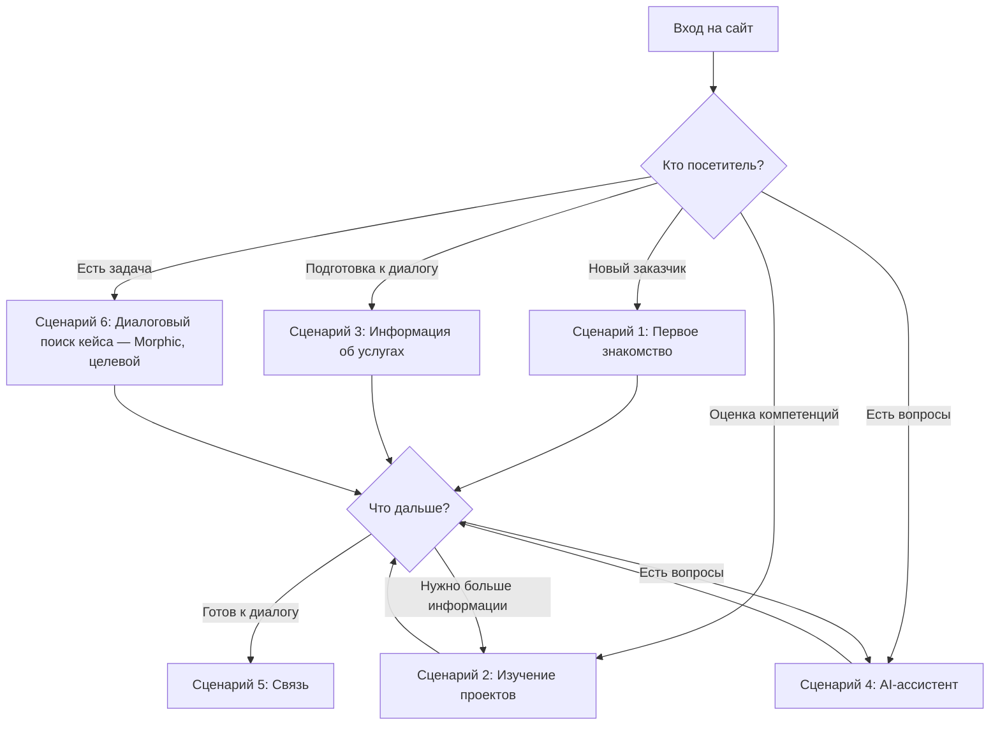
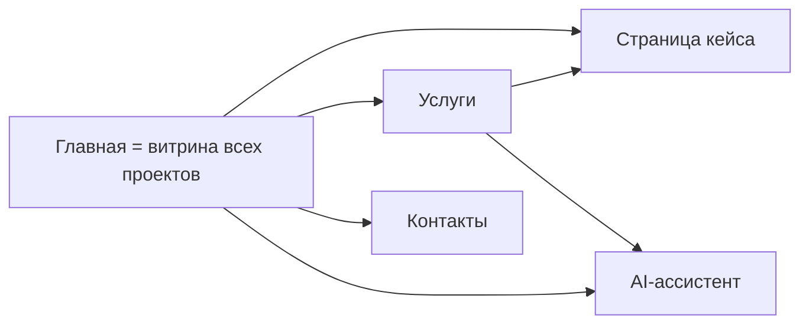

# SPEC.md — Продуктовая спецификация

**Проект:** ai-portfolio
**Версия:** 2.3
**Дата:** 2026-08-27
**Статус:** Утверждено

---

## 1. Назначение продукта

### Цель создания

Персональный сайт AI-инженера с интегрированным AI-ассистентом — платформа для демонстрации компетенций и привлечения заказчиков AI-автоматизации.

### Решаемая проблема

**Проблема:** Потенциальные заказчики не имеют единой точки входа для оценки AI-компетенций, изучения реализованных проектов и получения информации об услугах.

**Решение:** Сайт, который:
- представляет портфолио реализованных проектов;
- демонстрирует AI-компетенции в действии через AI-ассистента;
- предоставляет информацию об услугах и технологиях;
- снижает барьер для первого контакта.

### Создаваемая ценность

| Для кого | Ценность |
|----------|----------|
| **Заказчики AI-автоматизации** | Быстрая оценка компетенций, понимание возможностей, простой способ связаться |
| **Работодатели** | Оценка экспертизы кандидата, понимание реализованных проектов |
| **Владелец проекта** | Персональный бренд, точка входа для заказчиков, демонстрация компетенций |

---

## 2. Целевая аудитория

### Основная аудитория

**Потенциальные заказчики AI-автоматизации малого и среднего бизнеса**

| Характеристика | Описание |
|----------------|----------|
| **Кто это** | Владельцы малого и среднего бизнеса, руководители отделов, предприниматели |
| **Зачем приходит** | Найти специалиста по AI-автоматизации для решения бизнес-задач |
| **Какой результат должен получить** | Понимание экспертизы, оценка портфолио, информация об услугах, способ связаться |
| **Ключевые потребности** | Понять, какие задачи можно решить, сколько это стоит, как работает специалист |

### Дополнительная аудитория

#### Работодатели

| Характеристика | Описание |
|----------------|----------|
| **Кто это** | HR-специалисты, технические руководители, CTO |
| **Зачем приходит** | Оценить кандидата на позицию AI-инженера / промпт-инженера |
| **Какой результат должен получить** | Понимание компетенций, оценка реализованных проектов, контакт для приглашения на собеседование |

#### Коллеги

| Характеристика | Описание |
|----------------|----------|
| **Кто это** | Другие AI-инженеры, разработчики, специалисты по автоматизации |
| **Зачем приходит** | Изучить подходы, обменяться опытом, найти коллегу для сотрудничества |
| **Какой результат должен получить** | Понимание подходов к решению задач, контакт для обмена опытом |

#### Преподаватели и проверяющие

| Характеристика | Описание |
|----------------|----------|
| **Кто это** | Преподаватели курсов, менторы, проверяющие учебных программ |
| **Зачем приходит** | Оценить результаты обучения, проверить компетенции |
| **Какой результат должен получить** | Понимание освоенных навыков, оценка портфолио проектов |

---

## 3. Пользовательские сценарии

### Сценарий 1: Первое знакомство

**Кто:** Потенциальный заказчик, впервые услышавший о специалисте

**Цель:** Быстро понять, чем занимается специалист и какие задачи решает

**Шаги:**
1. Посетитель открывает главную страницу сайта
2. Видит краткое описание: кто такой, чем занимается, какие задачи решает
3. Видит призыв к действию: «Обсудить проект» или «Связаться со мной»
4. Может перейти к изучению портфолио или связаться сразу

**Результат:** Посетитель понимает, попал ли он по адресу, и знает, как связаться.

### Сценарий 2: Изучение проектов

**Кто:** Заказчик или работодатель, оценивающий компетенции

**Цель:** Понять глубину и ширину экспертизы через реализованные проекты

**Шаги:**
1. Посетитель переходит в раздел портфолио
2. Видит список кейсов с краткими описаниями
3. Выбирает интересующий кейс
4. Изучает страницу кейса: задача, решение, результат, технологии
5. При необходимости возвращается к списку или переходит к другому кейсу

**Результат:** Посетитель понимает, какие задачи уже решались, и может оценить качество работы.

### Сценарий 3: Получение информации об услугах

**Кто:** Потенциальный заказчик, готовящийся к диалогу

**Цель:** Понять, какие услуги предлагаются и как формируется стоимость

**Шаги:**
1. Посетитель открывает раздел с информацией об услугах
2. Видит перечень решаемых задач
3. Видит используемые технологии
4. Понимает, что стоимость обсуждается индивидуально
5. Находит способ связаться для обсуждения

**Результат:** Посетитель готов к диалогу, понимает, что стоимость формируется индивидуально.

### Сценарий 4: Взаимодействие с AI-ассистентом

**Кто:** Посетитель, у которого возникли вопросы

**Цель:** Получить ответы на вопросы о кейсах, услугах, технологиях

**Шаги:**
1. Посетитель видит AI-ассистента на сайте (виджет)
2. Задаёт вопрос на естественном языке
3. Получает ответ, основанный на базе знаний о кейсах и услугах
4. При необходимости задаёт уточняющие вопросы
5. При желании переходит к контактам для обсуждения проекта

**Результат:** Посетитель получает быстрые ответы, снижается барьер для первого контакта.

### Сценарий 5: Принятие решения о сотрудничестве

**Кто:** Заказчик, готовый к диалогу

**Цель:** Связаться со специалистом для обсуждения проекта

**Шаги:**
1. Посетитель изучил портфолио и услуги
2. Готов обсудить свой проект
3. Находит контакты: Telegram, Email
4. Выбирает удобный способ связи
5. Инициирует контакт

**Результат:** Заказчик связался со специалистом, диалог начат.

### Сценарий 6 (целевой): Диалоговый поиск релевантного кейса (Morphic-сцена)

**Кто:** Потенциальный заказчик, у которого есть задача, но нет времени листать каталог

**Цель:** От описания собственной задачи быстро выйти на релевантные кейсы и их доказательства

**Шаги:**
1. Посетитель на главной странице описывает свою задачу естественным языком
2. Система ведёт диалоговый поиск по материалам портфеля
3. Посетитель получает релевантные кейсы с объяснением применимости к его задаче
4. Выбирает кейс и переходит на его полноценную страницу (фиксированный Narrative кейса)
5. Изучает доказательства и переходит к обращению

**Результат:** Посетитель прошёл путь «описание задачи → диалоговый поиск → релевантные кейсы → выбранный лендинг».

**Граница Morphic-сцены (утверждено владельцем, 27.08.2026):**
- Morphic применяется **на уровне поиска и выбора релевантного кейса**; главная страница является сценой взаимодействия с портфелем.
- После выбора пользователь переходит на полноценную страницу кейса; внутри страницы действует **фиксированный Narrative конкретного кейса**.
- Morphic **не переносится внутрь лендинга** и не заменяет его структуру.
- Morphic **не был частью** выполненной пилотной интеграции главной — это целевой сценарий следующего этапа, **не реализованный** на 27.08.2026.
- Точная UX-механика Morphic проектируется отдельной задачей; новые сервисы, сущности и архитектурные компоненты добавляются только по отдельному решению владельца.

### Диаграмма пользовательских сценариев

> Сценарий 6 (Morphic-сцена) — целевой сценарий следующего этапа, не реализован на 27.08.2026; включён в диаграмму как целевое состояние (см. границы в описании Сценария 6).

---

## 4. Информационная архитектура

### Структура сайта

> Определено на основе стандартных практик персональных сайтов, материалов PEcf07–PEcf08 и решений владельца продукта.

| Раздел | Назначение | Основное содержимое | Связи |
|--------|------------|---------------------|-------|
| **Главная (`/`)** | Быстрое знакомство **и витрина всех проектов** | Краткое представление владельца, призыв к действию, навигация, флагманские и архивные карточки 13 кейсов | Все разделы |
| **Страницы кейсов (`/cases/...`)** | Полноценное представление каждого кейса | 13 страниц кейсов по единому шаблону | Главная, услуги |
| **Услуги (`/services.html`)** | Информация о решаемых задачах | Специализация, решаемые задачи, бизнес-ценность, технологии в контексте | Главная, кейсы |
| **Контакты (`/contacts.html`)** | Способ связаться | Telegram, Email | Все разделы |

**As-built (27.08.2026):** главная страница одновременно является страницей всех проектов — отдельный общий каталог проектов не является текущей основной витриной; устаревший каталог `portfolio.html` и маршрут `/projects` переадресуют на `/`. Страницы «Услуги» и «Контакты» созданы и включены в общую навигацию (`Главная / Проекты / Услуги / Контакты`, где «Проекты» ведёт на `/`).

**Решения владельца (первая версия):**
- Отдельная страница «О себе» не делается
- Краткое представление владельца размещается на главной странице

### Диаграмма навигации

### Портфолио: состав кейсов

Согласно актуальному составу `ProjectCard`, на сайте представлены **13 полноценных кейсов**. Placeholder-статус Prompt Review отменён: это полноценный finished-case с публичным репозиторием и страницей кейса.

| № | Кейс | Статус | Примечание |
|---|------|--------|------------|
| 1 | AI Curator | Production-ready | Featured (`display_order` 1); эталон шаблона |
| 2 | AI Data Assistant | Production-ready | Featured (`display_order` 2) |
| 3 | Review Flow | Демонстрационный сервис | Featured (`display_order` 3) |
| 4 | Review Auto Responder | Production-ready | Archive |
| 5 | Assistant Flow | Production-ready | Archive |
| 6 | Meeting Audit Bot | Production-ready | Archive |
| 7 | Lead Qualification | Production-ready | Archive |
| 8 | HR Assistant | Production-ready | Archive |
| 9 | HR Assistant — LoRA Fine-Tuning | Production-ready | Archive |
| 10 | Telegram Intake Bot | Production-ready | Archive |
| 11 | Telegram Onboarding Bot | Production-ready | Archive |
| 12 | Retail Group | Production-ready / Case Story | Archive |
| 13 | Prompt Review | Finished-case | Публичный репозиторий `AlexLvGulyaev/PromptReview`, полноценная страница кейса |

**Исключённые из публичной витрины карточки:** `telegram-ai-gateway`, `competitor-monitor-ai` — присутствуют в `ProjectCard`, но не отображаются на главной (`is_visible = false` / вне первых 13 по `display_order`).

**Порядок в каталоге:** по полю `display_order` (управляется в административной консоли / БД).

**Карточки на главной странице:**

Главная страница отображает все видимые карточки (`is_visible = true`). Первые три по `display_order` выводятся как **флагманские карточки** (featured cards), остальные — как **карточки архива/каталога** (archive cards).

Поле `show_on_homepage` сохраняется для обратной совместимости административной консоли, но в публичном frontend не используется как фильтр: видимость определяется `is_visible`, а приоритет и роль карточки — `display_order`.

**Управляемые карточки проектов:**

Карточки проектов в каталоге портфолио и на главной странице являются **управляемым контентом**. Их единственный Source of Truth — таблица `ProjectCard` в PostgreSQL. Административная консоль является единственным интерфейсом управления карточками.

Публичный frontend получает карточки проектов через единый **read-only API backend** и отображает их на главной странице без хранения канонических данных в статическом HTML. Главная страница сортирует карточки по `display_order`; первые три выделяются визуально, остальные идут в архивную секцию.

**Граница:** статические HTML-страницы отдельных кейсов остаются без изменений и продолжают содержать Narrative Blueprint. ProjectCard управляет только представлением карточки в каталоге и на главной, а не детальным содержанием страницы кейса.

### Страница кейса: состав информации

> Определено на основе материалов PEcf07: «Структура хорошего примера: Задача клиента, Наше решение, Измеримый результат».

| Элемент | Назначение | Источник |
|---------|------------|----------|
| **Заголовок** | Название проекта | PEcf08 |
| **Задача клиента** | Какую проблему нужно было решить | PEcf07 |
| **Наше решение** | Что конкретно было сделано | PEcf07 |
| **Измеримый результат** | Какой бизнес-эффект получил клиент | PEcf07 |
| **Технологии** | Какие технологии использовались | PEcf08 |
| **Изображение** | Визуальное представление | PEcf08 |
| **Кнопка «Подробнее»** | Переход к детальному описанию | PEcf08 |

**Шаблон страницы кейса:** Все 13 страниц кейсов AI Portfolio выполняются в едином dual-theme шаблоне (`AIP Case Landing Page Standard v1.1`). Фактическая эталонная реализация — рабочая страница AI Curator (`/cases/ai-curator.html`; файл `ai-curator-template-preview.html` является устаревшим backup-шаблоном, не эталоном). Шаблон включает: вертикальный hero с eyebrow `Featured Case · <домен> / <тег>`; единый DOM для светлой и тёмной темы через `data-theme` + CSS custom properties; SVG-иллюстрации ключевых сценариев; highlight-тезис в секции CTA; footer с позиционированием продукта и прямой ссылкой на live-demo/admin.

### Услуги: формат представления

> Определено на основе материалов PEcf07: «1. Чёткая специализация, 2. Ценность для бизнеса, 3. Примеры работ».

| Элемент | Содержание |
|---------|------------|
| **Специализация** | Чёткое позиционирование: «AI-инженер, специализирующийся на автоматизации» |
| **Решаемые задачи** | Конкретные задачи, которые решает специалист |
| **Бизнес-ценность** | Экономия времени, денег, ресурсов для клиента |
| **Технологии** | Используемые технологии в контексте задач |
| **Примеры работ** | Ссылки на кейсы как доказательство |

**Решение:** Раздел «Технологии» не нужен — технологии представлены в контексте услуг и кейсов. (PEcf07: «Клиенту важен результат, а не инструменты»)

---

## 5. Функциональные требования

### 5.1. Сайт-портфолио

| Функция | Описание | Решение |
|---------|---------|---------|
| Главная страница | Краткое представление владельца, призыв к действию, блок кейсов | Определено: раздел 4 |
| Каталог кейсов | Список реализованных проектов с краткими описаниями | Определено: карточка кейса + детальная страница |
| Страницы кейсов | Детальное представление каждого проекта | Определено: задача, решение, результат, технологии |
| Информация об услугах | Специализация, решаемые задачи, бизнес-ценность | Определено: чёткая специализация + ценность + примеры |
| Контактная информация | Telegram, Email | Определено: PROJECT_STATE.md + Решение владельца |

**Решения владельца (первая версия):**
- Каналы связи: Telegram и Email
- Отдельная страница «О себе» не делается — представление на главной

### 5.2. Каналы связи

> Определено на основе решений владельца продукта.

| Канал | Назначение | Статус |
|-------|------------|--------|
| **Telegram** | Основной канал связи с владельцем | Первая версия |
| **Email** | Альтернативный канал связи | Первая версия |

### 5.3. AI-ассистент

| Функция | Описание | Решение |
|---------|---------|---------|
| Веб-виджет | AI-ассистент, встроенный в сайт | Определено: PROJECT_STATE.md |
| Ответы на вопросы | Ответы о кейсах, услугах, технологиях, стоимости, контактах | Определено: следует из назначения продукта |
| Глубина ответов | Развёрнутые ответы с перенаправлением на контакт | Определено: PEcf07 (CTA для сложных задач) |
| Перенаправление на контакт | Да, при вопросах о стоимости и сложных задачах | Определено: PEcf07 («Напишите мне в Telegram для оценки») |
| База знаний | Информация о кейсах и услугах | Определено: наполняется владельцем (PROJECT_STATE.md) |

**Типы вопросов, на которые отвечает AI-ассистент:**
- О кейсах: «Что делает Assistant Flow?», «Какие технологии используются?"
- Об услугах: «Какие задачи вы решаете?», «Какова стоимость?» → перенаправление на контакт
- О технологиях: «С какими AI-системами вы работаете?"
- О сотрудничестве: «Как с вами связаться?"

### 5.4. Telegram

> Определено на основе решений владельца продукта.

| Функция | Описание | Статус |
|---------|---------|--------|
| Канал связи | Telegram как основной способ связи с владельцем | Первая версия |
| Telegram-бот | Отдельный Telegram-бот для AI-ассистента | Не делается в первой версии |

**Решение владельца (первая версия):**
- Telegram используется как канал связи с владельцем
- Отдельный Telegram-бот для сайта не делается
- Вопрос о боте перенесён в backlog последующих версий

---

## 6. Нефункциональные требования

### 6.1. Доступность

| Требование | Описание |
|-------------|----------|
| Доступность 24/7 | Сайт должен быть доступен постоянно (VPS) |
| Отказоустойчивость | При падении AI-ассистента сайт должен продолжать работать |

**Оставшиеся технические вопросы:**
- Требования к доступности для разных устройств не определены

### 6.2. Производительность

| Требование | Значение |
|-------------|----------|
| Корректность ответов AI-ассистента | ≥90% на контрольном наборе вопросов |
| Время ответа AI-ассистента | <5 секунд |

**Оставшиеся технические вопросы (не утверждены):**
- Требования к времени загрузки публичных страниц не определены
- Ожидаемая нагрузка не определена

### 6.3. Безопасность

| Требование | Описание |
|-------------|----------|
| Защита контактных данных | Не публиковать личные данные в открытом виде без необходимости |
| Защита API-ключей | API-ключи не должны быть доступны публично |
| Аутентификация административного контура | Bearer token (`ADMIN_API_TOKEN`); административный API защищён |

**Оставшиеся технические вопросы:**
- Требования к защите от ботов не определены

### 6.4. Сопровождаемость

| Требование | Описание |
|-------------|----------|
| Обновление базы знаний | Владелец управляет источниками и составом индексируемых материалов через Admin Console; обновление — через синхронизацию подключённых GitHub-источников (см. §9.1) |
| Поддержка | Владелец проекта осуществляет поддержку (определено в PROJECT_STATE) |

### 6.5. Эксплуатация

| Требование | Описание |
|-------------|----------|
| Хостинг | Существующий VPS (определено в PROJECT_STATE) |
| AI-провайдер | Multi-provider: OpenAI (primary) + GigaChat (fallback) |
| Логирование | Реализовано: execution tracing, operational logs, аудит входа в админку и посещений сайта |

**Оставшиеся технические вопросы:**
- Требования к внешнему мониторингу и алертингу не определены

### 6.6. Качество контента

| Требование | Описание |
|-------------|----------|
| Визуальный стиль | Инженерный минимализм, использование материалов из attachments/branding/ |
| Тон и стиль | Не использовать шаблонный «AI-футуризм», не перегруженные лендинги |
| Единый шаблон страницы кейса | Все лендинги кейсов следуют `AIP Case Landing Page Standard v1.1`; фактический эталон — рабочая страница AI Curator (`/cases/ai-curator.html`) |

---

## 7. Ограничения

### Зафиксированные ограничения (из PROJECT_STATE.md)

| Ограничение | Значение |
|-------------|----------|
| **Продукт** | Персональный сайт AI-инженера, AI-ассистент — функция сайта |
| **Целевая аудитория** | Основная: заказчики AI-автоматизации МСБ |
| **Портфолио** | 13 полноценных кейсов APL |
| **Услуги** | Без прайс-листа, стоимость обсуждается индивидуально |
| **CTA** | «Обсудить проект» или «Связаться со мной» |
| **Telegram** | Канал связи с владельцем, но сайт — главная точка входа |
| **Хостинг** | Существующий VPS |
| **Поддержка** | Владелец проекта |
| **AI-провайдер** | OpenAI (первый этап) |
| **Визуальный стиль** | Инженерный минимализм, материалы из attachments/branding/ |

### Решения владельца (первая версия)

| Решение | Значение |
|---------|----------|
| **Страница «О себе»** | Не делается отдельной страницей |
| **Представление владельца** | Краткое представление на главной странице |
| **Каналы связи** | Telegram и Email |
| **Telegram-бот** | Не делается в первой версии, вопрос в backlog |

### Оставшиеся технические вопросы (относятся к IMPLEMENTATION_PLAN)

> Решённые вопросы (формат KB, процесс обновления KB, аутентификация административного контура, каналы связи — Telegram и Email) исключены из перечня. Оставшиеся вопросы:
> - Память диалога AI-ассистента (post-MVP)
> - Требования к времени загрузки публичных страниц
> - Требования к нагрузке
> - Требования к внешнему мониторингу и алертингу

Полный список технических вопросов: `task_history/2026-07-12_task-spec-creation.md`

---

## 8. Административная консоль

> **As-built (27.08.2026):** Admin Console v1 реализована и развёрнута в production. Стек: React + TypeScript + Vite (frontend), FastAPI (backend API, Bearer token `ADMIN_API_TOKEN`). Управление проектами и KB входит в первую production-ready версию; presale-события и presale-аналитика ещё не реализованы.

### 8.1. Назначение административной консоли

Административная консоль предоставляет владельцу проекта интерфейс для мониторинга и управления содержимым AI Portfolio без необходимости редактировать файлы вручную.

### 8.2. Фактические рабочие пространства (v1)

Фактически присутствуют **пять разделов навигации**.

#### Dashboard

- Единая сводная картина состояния AI Portfolio.
- Предназначен для мониторинга, а не для управления содержимым.
- Примеры метрик: статус AI-провайдеров, состояние базы знаний, объём логов, активность диалогов.

#### Content / Knowledge Base

- Управление:
  - карточками проектов;
  - управляемым содержимым портфолио;
  - источниками базы знаний и их допуском к индексации;
  - запуском синхронизации базы знаний.

**Границы:**
- Редактирование Narrative Blueprint **не входит** в задачи административной консоли.
- Редактирование Presentation Patterns **не входит** в задачи административной консоли.
- Эти артефакты остаются инженерными документами проекта и сопровождаются непосредственно в репозиториях.
- Административная консоль **не является визуальным конструктором страниц кейсов**.

#### Logs / Conversations

- Рабочее пространство эксплуатации.
- Включает:
  - operational logs;
  - историю обращений;
  - историю диалогов;
  - диагностическую информацию.

#### Audit

- Журнал аудита входа в административный контур и посещений сайта.

#### Presale-аналитика (план)

- Presale-события и базовое представление воронки — **не реализованы**; входят в остаточный план (см. `IMPLEMENTATION_PLAN.md` §4.5).

### 8.3. Техническая реализация

Стек реализован: React + TypeScript + Vite, FastAPI backend API. Схемы API зафиксированы в коде backend и `docs/ARCHITECTURE.md`.

---

## 9. Архитектура Knowledge Base

### 9.1. Источники данных

AI Portfolio использует три уровня источников данных с чётким разделением ролей.

#### GitHub

- **Source of Truth для проектной документации.**
- Основной источник знаний для AI-ассистента — документация проектов, хранящаяся в репозиториях.
- **Состав источников (предварительный реестр, 27.08.2026):** 13 кейсам предварительно соответствуют 12 публичных проектных репозиториев + собственный корпус AI Portfolio (`AI-Portfolio`; HR-Assistant обслуживает кейсы HR Assistant и HRA-LoRA; репозиторий `Retail-Group` существует — README кейса и пресейл-документация). Проверено по локальным git-remotes и GitHub API; целевой состав источников уточняется в рамках KB admission gate, предварительный реестр требует фактической проверки. Фактически подключено 7 GitHub-источников (~5400 чанков; значение по данным анализа от 27.08, по живому состоянию ChromaDB не перепроверено).
- **Выборочный состав индексируемых материалов:** подключение репозитория не означает индексацию всех найденных в нём Markdown-файлов. Каждый источник проходит допуск к индексации (KB admission gate): проверка публичности, актуальности и непротиворечивости, определение разрешённого состава, исключение внутренних, устаревших и неточных документов. Качество источников напрямую влияет на обязательную метрику корректности AI-ассистента (≥90%).
- Административная консоль управляет перечнем подключённых источников, их допуском к индексации и инициирует синхронизацию.
- Автоматическая синхронизация по webhook **не входит в первую версию**.

#### PostgreSQL

- **Source of Truth для управляемых данных сайта.**
- Хранит:
  - карточки проектов;
  - настройки портфолио;
  - эксплуатационные данные;
  - журналы;
  - диалоги.
- PostgreSQL **не является основным хранилищем проектной документации**.

#### ChromaDB

- Исключительно **поисковый индекс**.
- **Не является Source of Truth.**
- Содержимое ChromaDB может быть полностью перестроено из актуальных источников.

### 9.2. Разделение ответственности

| Компонент | Роль | Source of Truth |
|-----------|------|-----------------|
| GitHub | Проектная документация | ✅ Да |
| PostgreSQL | Управляемые данные сайта, эксплуатация | ✅ Да |
| ChromaDB | Векторный поисковый индекс | ❌ Нет |

---

## 10. Narrative Blueprint и Presentation Patterns

### 10.1. Разделение ролей

| Артефакт | Отвечает за |
|----------|-------------|
| **Narrative Blueprint** | Что рассказывает страница проекта, порядок раскрытия материала, драматургию проекта |
| **Presentation Patterns** | Как эта информация отображается пользователю |

### 10.2. Границы административной консоли

- Административная консоль **не редактирует Narrative Blueprint**.
- Административная консоль **не редактирует библиотеку Presentation Patterns**.
- Административная консоль работает только с управляемым контентом внутри уже утверждённой структуры.

### 10.3. Порядок разработки кейсов

При разработке нового кейса сначала разрабатывается Narrative Blueprint. После этого Narrative реализуется посредством выбора и применения Presentation Patterns.

---

## 11. Критерии готовности первой версии

> Примечание: Терминология «MVP» не используется по требованию задания.

### Критерий 1: Сайт доступен и функционален

| Признак | Описание |
|---------|----------|
| Главная страница | Отображается корректно, содержит основную информацию |
| Портфолио | Все 13 полноценных кейсов представлены с согласованным составом информации |
| Услуги | Раздел содержит информацию о решаемых задачах, технологиях, бизнес-ценности |
| Контакты | Доступны способы связи (Telegram, Email, форма) |
| Навигация | Пользователь может перемещаться между разделами |
| Визуальный стиль | Соответствует инженерному минимализму, использует branding-материалы |
| Страницы кейсов | Все завершённые кейсы представлены страницами по `AIP Case Landing Page Standard v1.1`; переключение темы, структура и CTA единообразны (эталон — AI Curator) |

### Критерий 2: AI-ассистент работает

| Признак | Описание |
|---------|----------|
| Виджет | Отображается на сайте, доступен для взаимодействия |
| Ответы | AI-ассистент отвечает на вопросы о кейсах и услугах |
| База знаний | Содержит информацию о кейсах и услугах |
| Fallback | При недоступности AI сайт продолжает работать |

### Критерий 3: Каналы связи работают

| Признак | Описание |
|---------|----------|
| Telegram | Ссылка ведёт на рабочий контакт |
| Email | Ссылка ведёт на рабочий контакт |

### Критерий 4: Сайт развёрнут на VPS

| Признак | Описание |
|---------|----------|
| Доступность | Сайт доступен по доменному имени |
| 24/7 | Сайт работает постоянно |
| Владелец | Владелец может обновлять контент |

### Критерий 5: Документация актуальна

| Признак | Описание |
|---------|----------|
| DEPLOYMENT_GUIDE | Существует и позволяет развернуть с нуля |
| README | Описывает проект и способ запуска |

---

## Приложение А: Источники решений

| Решение | Источник |
|---------|----------|
| Продукт: персональный сайт AI-инженера | PROJECT_STATE.md — Owner Decisions (SOT) |
| AI-ассистент как функция сайта | PROJECT_STATE.md — Owner Decisions (SOT) |
| Целевая аудитория | PROJECT_STATE.md — Owner Decisions (SOT) |
| Портфолио: 13 полноценных кейсов | PROJECT_STATE.md — Owner Decisions (SOT) |
| Без прайс-листа | PROJECT_STATE.md — Owner Decisions (SOT) |
| CTA: «Обсудить проект» | PROJECT_STATE.md — Owner Decisions (SOT) |
| Telegram: канал связи | PROJECT_STATE.md — Owner Decisions (SOT) |
| VPS, поддержка владельцем | PROJECT_STATE.md — Owner Decisions (SOT) |
| OpenAI на первом этапе | PROJECT_STATE.md — Owner Decisions (SOT) |
| База знаний поддерживается владельцем | PROJECT_STATE.md — Owner Decisions (SOT) |
| Инженерный минимализм | PROJECT_STATE.md — Owner Decisions (SOT) |

---

## Приложение Б: Принятые решения владельца продукта

> Вопросы продуктового уровня закрыты решениями владельца; оставшиеся технические вопросы приведены в разделе 7.

| Вопрос | Решение |
|--------|---------|
| Страница «О себе» | Не делается отдельной страницей. Краткое представление на главной. |
| Каналы связи | Telegram и Email; контактная форма не предусмотрена. |
| Telegram-бот | Не делается в первой версии. Telegram — канал связи с владельцем. Вопрос о боте в backlog. |
| Состав портфолио | 13 полноценных кейсов (актуализация 27.08.2026: Prompt Review — полноценный finished-case, placeholder-статус отменён). |
| Логика главной страницы | Все видимые карточки выводятся на главной. `display_order` 1..3 — флагманы, 4+ — архив. `show_on_homepage` не используется для фильтрации. Главная страница одновременно является витриной всех проектов. |
| Prompt Review | Полноценный finished-case с публичным репозиторием и страницей кейса (27.08.2026). |
| Morphic | Согласованное направление следующего этапа: диалоговый поиск и выбор релевантного кейса на главной; не реализовано, UX-механика — отдельная задача (см. Сценарий 6). |

---

## Приложение В: Технические вопросы (backlog для IMPLEMENTATION_PLAN)

> Полный список технических вопросов, которые будут решаться на этапе IMPLEMENTATION_PLAN.

| № | Вопрос | Категория |
|---|--------|-----------|
| ФН-7 | Нужна ли память диалога AI-ассистента? | Функциональность (post-MVP) |
| ФН-8 | Нужен ли Telegram-бот? | Функциональность (в backlog последующих версий) |
| НФ-1 | Требования к времени загрузки публичных страниц? | Нефункциональные требования |
| НФ-3 | Ожидаемая нагрузка (посетители в день)? | Нефункциональные требования |
| НФ-5 | Требования к внешнему мониторингу и алертингу? | Нефункциональные требования |

> Исключены из перечня как решённые: формат KB и процесс обновления (GitHub Sync + Admin Console, §9.1), требования к времени ответа AI-ассистента (<5 секунд), аутентификация административного контура (Bearer token), обработка обращений с формы (форма не делается — закрытое решение).

---

## История изменений

| Дата | Версия | Изменения |
|------|--------|-----------|
| 2026-07-12 | 1.0 | Первая версия SPEC на основе PROJECT_STATE.md |
| 2026-07-12 | 1.1 | Классификация открытых вопросов, закрытие вопросов категории 2, перенос вопросов категории 3 в backlog |
| 2026-07-12 | 1.2 | Закрытие всех открытых вопросов решениями владельца продукта |
| 2026-08-25 | 2.0 | Актуализация под dual-theme главную: 13 карточек (12 проектов + Prompt Review placeholder), логика featured/archive по `display_order`, deprecation `show_on_homepage` |
| 2026-08-25 | 2.1 | Корректирующий проход: уточнён состав 12 завершённых проектов (убраны Telegram AI Gateway и Competitor Monitor AI, добавлены Review Auto Responder, Meeting Audit Bot, Telegram Onboarding Bot), исправлена путаница Telegram Support Bot / Telegram Intake Bot, Prompt Review зафиксирован как placeholder без Light/Dark-пары |
| 2026-08-25 | 2.2 | Зафиксирован единый dual-theme шаблон лендинга кейса (`AIP Case Landing Page Standard v1.1`): добавлены требования к структуре страницы кейса, эталонная реализация AI Curator, критерий готовности для страниц кейсов |
| 2026-08-27 | 2.3 | As-built baseline приведён к фактическому продукту на 27.08.2026: 13 полноценных кейсов (Prompt Review — finished-case, placeholder отменён); главная страница = витрина всех проектов, `portfolio.html`/`/projects` — redirect на `/`; «Услуги» и «Контакты» в навигации; эталон шаблона кейса — `/cases/ai-curator.html` (не `ai-curator-template-preview.html`); состав KB — предварительно 12 проектных репозиториев + собственный корпус AI Portfolio (проверено по git-remotes и GitHub API; финальный состав — через KB admission gate), выборочный состав индексируемых материалов через KB admission gate; добавлен целевой Morphic-сценарий (Сценарий 6) и его граница с фиксированным Narrative страницы кейса. Версия прошла корректирующую сверку (27.08.2026): устранены устаревшие утверждения о производительности, форме обратной связи и Admin Console; открытые вопросы разделены с решёнными. Продукт не перепроектирован |
