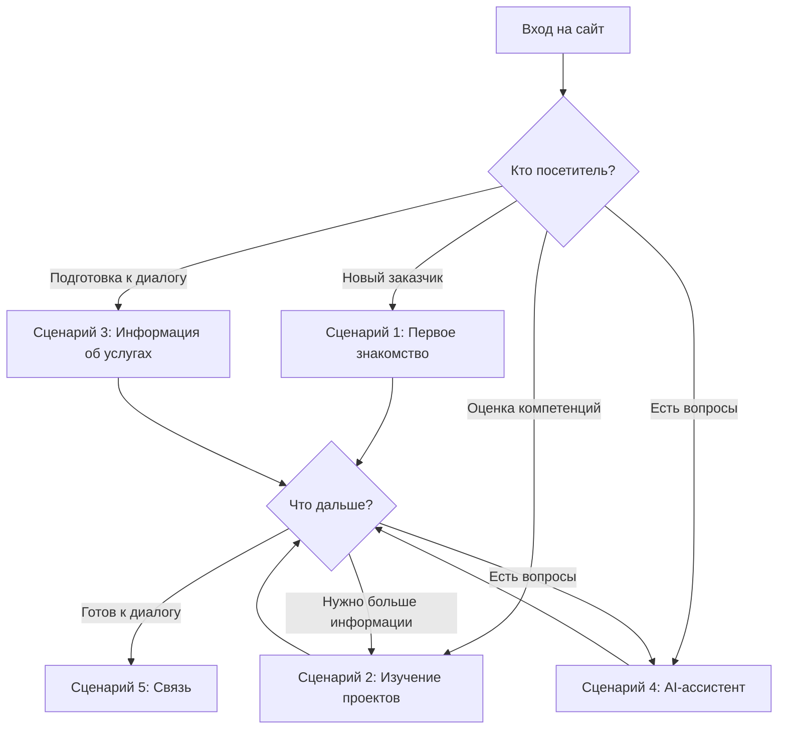
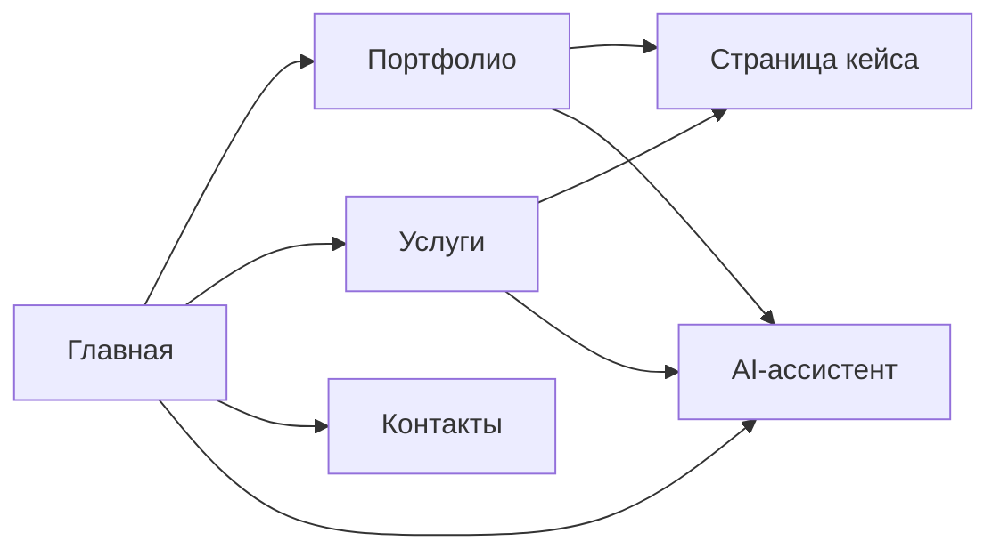

# SPEC.md — Продуктовая спецификация

**Проект:** ai-portfolio
**Версия:** 1.0
**Дата:** 2026-07-12
**Статус:** Черновик

---

## 1. Назначение продукта

### Цель создания

Персональный сайт AI-инженера с интегрированным AI-ассистентом — платформа для демонстрации компетенций и привлечения заказчиков AI-автоматизации.

### Решаемая проблема

**Проблема:** Потенциальные заказчики не имеют единой точки входа для оценки AI-компетенций, изучения реализованных проектов и получения информации об услугах.

**Решение:** Сайт, который:
- представляет портфолио реализованных проектов;
- демонстрирует AI-компетенции в действии через AI-ассистента;
- предоставляет информацию об услугах и технологиях;
- снижает барьер для первого контакта.

### Создаваемая ценность

| Для кого | Ценность |
|----------|----------|
| **Заказчики AI-автоматизации** | Быстрая оценка компетенций, понимание возможностей, простой способ связаться |
| **Работодатели** | Оценка экспертизы кандидата, понимание реализованных проектов |
| **Владелец проекта** | Персональный бренд, точка входа для заказчиков, демонстрация компетенций |

---

## 2. Целевая аудитория

### Основная аудитория

**Потенциальные заказчики AI-автоматизации малого и среднего бизнеса**

| Характеристика | Описание |
|----------------|----------|
| **Кто это** | Владельцы малого и среднего бизнеса, руководители отделов, предприниматели |
| **Зачем приходит** | Найти специалиста по AI-автоматизации для решения бизнес-задач |
| **Какой результат должен получить** | Понимание экспертизы, оценка портфолио, информация об услугах, способ связаться |
| **Ключевые потребности** | Понять, какие задачи можно решить, сколько это стоит, как работает специалист |

### Дополнительная аудитория

#### Работодатели

| Характеристика | Описание |
|----------------|----------|
| **Кто это** | HR-специалисты, технические руководители, CTO |
| **Зачем приходит** | Оценить кандидата на позицию AI-инженера / промпт-инженера |
| **Какой результат должен получить** | Понимание компетенций, оценка реализованных проектов, контакт для приглашения на собеседование |

#### Коллеги

| Характеристика | Описание |
|----------------|----------|
| **Кто это** | Другие AI-инженеры, разработчики, специалисты по автоматизации |
| **Зачем приходит** | Изучить подходы, обменяться опытом, найти коллегу для сотрудничества |
| **Какой результат должен получить** | Понимание подходов к решению задач, контакт для обмена опытом |

#### Преподаватели и проверяющие

| Характеристика | Описание |
|----------------|----------|
| **Кто это** | Преподаватели курсов, менторы, проверяющие учебных программ |
| **Зачем приходит** | Оценить результаты обучения, проверить компетенции |
| **Какой результат должен получить** | Понимание освоенных навыков, оценка портфолио проектов |

---

## 3. Пользовательские сценарии

### Сценарий 1: Первое знакомство

**Кто:** Потенциальный заказчик, впервые услышавший о специалисте

**Цель:** Быстро понять, чем занимается специалист и какие задачи решает

**Шаги:**
1. Посетитель открывает главную страницу сайта
2. Видит краткое описание: кто такой, чем занимается, какие задачи решает
3. Видит призыв к действию: «Обсудить проект» или «Связаться со мной»
4. Может перейти к изучению портфолио или связаться сразу

**Результат:** Посетитель понимает, попал ли он по адресу, и знает, как связаться.

### Сценарий 2: Изучение проектов

**Кто:** Заказчик или работодатель, оценивающий компетенции

**Цель:** Понять глубину и ширину экспертизы через реализованные проекты

**Шаги:**
1. Посетитель переходит в раздел портфолио
2. Видит список кейсов с краткими описаниями
3. Выбирает интересующий кейс
4. Изучает страницу кейса: задача, решение, результат, технологии
5. При необходимости возвращается к списку или переходит к другому кейсу

**Результат:** Посетитель понимает, какие задачи уже решались, и может оценить качество работы.

### Сценарий 3: Получение информации об услугах

**Кто:** Потенциальный заказчик, готовящийся к диалогу

**Цель:** Понять, какие услуги предлагаются и как формируется стоимость

**Шаги:**
1. Посетитель открывает раздел с информацией об услугах
2. Видит перечень решаемых задач
3. Видит используемые технологии
4. Понимает, что стоимость обсуждается индивидуально
5. Находит способ связаться для обсуждения

**Результат:** Посетитель готов к диалогу, понимает, что стоимость формируется индивидуально.

### Сценарий 4: Взаимодействие с AI-ассистентом

**Кто:** Посетитель, у которого возникли вопросы

**Цель:** Получить ответы на вопросы о кейсах, услугах, технологиях

**Шаги:**
1. Посетитель видит AI-ассистента на сайте (виджет)
2. Задаёт вопрос на естественном языке
3. Получает ответ, основанный на базе знаний о кейсах и услугах
4. При необходимости задаёт уточняющие вопросы
5. При желании переходит к контактам для обсуждения проекта

**Результат:** Посетитель получает быстрые ответы, снижается барьер для первого контакта.

### Сценарий 5: Принятие решения о сотрудничестве

**Кто:** Заказчик, готовый к диалогу

**Цель:** Связаться со специалистом для обсуждения проекта

**Шаги:**
1. Посетитель изучил портфолио и услуги
2. Готов обсудить свой проект
3. Находит контакты: Telegram, Email, форма связи
4. Выбирает удобный способ связи
5. Инициирует контакт

**Результат:** Заказчик связался со специалистом, диалог начат.

### Диаграмма пользовательских сценариев

---

## 4. Информационная архитектура

### Структура сайта

> Определено на основе стандартных практик персональных сайтов, материалов PEcf07–PEcf08 и решений владельца продукта.

| Раздел | Назначение | Основное содержимое | Связи |
|--------|------------|---------------------|-------|
| **Главная** | Быстрое знакомство | Краткое представление владельца, призыв к действию, навигация, блок кейсов | Все разделы |
| **Портфолио** | Демонстрация кейсов | Список кейсов (каталог), страницы отдельных кейсов | Главная, услуги |
| **Услуги** | Информация о решаемых задачах | Специализация, решаемые задачи, бизнес-ценность, технологии в контексте | Главная, портфолио |
| **Контакты** | Способ связаться | Telegram, Email | Все разделы |

**Решения владельца (первая версия):**
- Отдельная страница «О себе» не делается
- Краткое представление владельца размещается на главной странице

### Диаграмма навигации

### Портфолио: состав кейсов

Согласно PROJECT_STATE.md, на сайте представлены следующие кейсы:

| № | Кейс | Статус в APL |
|---|------|--------------|
| 1 | Assistant Flow | Production-ready |
| 2 | Review Flow | Демонстрационный MVP |
| 3 | Lead Qualification | Production-ready |
| 4 | HR Assistant | Production-ready |
| 5 | Prompt Review | Production-ready |
| 6 | Telegram AI Gateway | Production-ready |
| 7 | Competitor Monitor AI | — |

**Порядок:** Хронологический или по приоритету (новые/важные — первыми).

**Управляемые карточки проектов:**

Карточки проектов в каталоге портфолио являются **управляемым контентом**. Их единственный Source of Truth — таблица `ProjectCard` в PostgreSQL. Административная консоль является единственным интерфейсом управления карточками.

Публичный frontend получает карточки проектов через **read-only API backend** и отображает их в каталоге портфолио без хранения канонических данных в статическом HTML.

**Граница:** статические HTML-страницы отдельных кейсов остаются без изменений и продолжают содержать Narrative Blueprint. ProjectCard управляет только представлением карточки в каталоге, а не детальным содержанием страницы кейса.

### Страница кейса: состав информации

> Определено на основе материалов PEcf07: «Структура хорошего примера: Задача клиента, Наше решение, Измеримый результат».

| Элемент | Назначение | Источник |
|---------|------------|----------|
| **Заголовок** | Название проекта | PEcf08 |
| **Задача клиента** | Какую проблему нужно было решить | PEcf07 |
| **Наше решение** | Что конкретно было сделано | PEcf07 |
| **Измеримый результат** | Какой бизнес-эффект получил клиент | PEcf07 |
| **Технологии** | Какие технологии использовались | PEcf08 |
| **Изображение** | Визуальное представление | PEcf08 |
| **Кнопка «Подробнее»** | Переход к детальному описанию | PEcf08 |

### Услуги: формат представления

> Определено на основе материалов PEcf07: «1. Чёткая специализация, 2. Ценность для бизнеса, 3. Примеры работ».

| Элемент | Содержание |
|---------|------------|
| **Специализация** | Чёткое позиционирование: «AI-инженер, специализирующийся на автоматизации» |
| **Решаемые задачи** | Конкретные задачи, которые решает специалист |
| **Бизнес-ценность** | Экономия времени, денег, ресурсов для клиента |
| **Технологии** | Используемые технологии в контексте задач |
| **Примеры работ** | Ссылки на кейсы как доказательство |

**Решение:** Раздел «Технологии» не нужен — технологии представлены в контексте услуг и кейсов. (PEcf07: «Клиенту важен результат, а не инструменты»)

---

## 5. Функциональные требования

### 5.1. Сайт-портфолио

| Функция | Описание | Решение |
|---------|---------|---------|
| Главная страница | Краткое представление владельца, призыв к действию, блок кейсов | Определено: раздел 4 |
| Каталог кейсов | Список реализованных проектов с краткими описаниями | Определено: карточка кейса + детальная страница |
| Страницы кейсов | Детальное представление каждого проекта | Определено: задача, решение, результат, технологии |
| Информация об услугах | Специализация, решаемые задачи, бизнес-ценность | Определено: чёткая специализация + ценность + примеры |
| Контактная информация | Telegram, Email | Определено: PROJECT_STATE.md + Решение владельца |

**Решения владельца (первая версия):**
- Форма обратной связи не делается
- Каналы связи: Telegram и Email
- Отдельная страница «О себе» не делается — представление на главной

### 5.2. Каналы связи

> Определено на основе решений владельца продукта.

| Канал | Назначение | Статус |
|-------|------------|--------|
| **Telegram** | Основной канал связи с владельцем | Первая версия |
| **Email** | Альтернативный канал связи | Первая версия |

### 5.3. AI-ассистент

### 5.3. AI-ассистент

| Функция | Описание | Решение |
|---------|---------|---------|
| Веб-виджет | AI-ассистент, встроенный в сайт | Определено: PROJECT_STATE.md |
| Ответы на вопросы | Ответы о кейсах, услугах, технологиях, стоимости, контактах | Определено: следует из назначения продукта |
| Глубина ответов | Развёрнутые ответы с перенаправлением на контакт | Определено: PEcf07 (CTA для сложных задач) |
| Перенаправление на контакт | Да, при вопросах о стоимости и сложных задачах | Определено: PEcf07 («Напишите мне в Telegram для оценки») |
| База знаний | Информация о кейсах и услугах | Определено: наполняется владельцем (PROJECT_STATE.md) |

**Типы вопросов, на которые отвечает AI-ассистент:**
- О кейсах: «Что делает Assistant Flow?», «Какие технологии используются?»
- Об услугах: «Какие задачи вы решаете?», «Какова стоимость?» → перенаправление на контакт
- О технологиях: «С какими AI-системами вы работаете?»
- О сотрудничестве: «Как с вами связаться?»

### 5.4. Telegram

> Определено на основе решений владельца продукта.

| Функция | Описание | Статус |
|---------|---------|--------|
| Канал связи | Telegram как основной способ связи с владельцем | Первая версия |
| Telegram-бот | Отдельный Telegram-бот для AI-ассистента | Не делается в первой версии |

**Решение владельца (первая версия):**
- Telegram используется как канал связи с владельцем
- Отдельный Telegram-бот для сайта не делается
- Вопрос о боте перенесён в backlog последующих версий

---

## 6. Нефункциональные требования

### 6.1. Доступность

| Требование | Описание |
|-------------|----------|
| Доступность 24/7 | Сайт должен быть доступен постоянно (VPS) |
| Отказоустойчивость | При падении AI-ассистента сайт должен продолжать работу |

**Открытые вопросы:**
- Требования к времени отклика не определены
- Требования к доступности для разных устройств не определены

### 6.2. Производительность

**Открытые вопросы:**
- Требования к времени загрузки страниц не определены
- Требования к времени ответа AI-ассистента не определены
- Ожидаемая нагрузка не определена

### 6.3. Безопасность

| Требование | Описание |
|-------------|----------|
| Защита контактных данных | Не публиковать личные данные в открытом виде без необходимости |
| Защита API-ключей | API-ключи OpenAI не должны быть доступны публично |

**Открытые вопросы:**
- Требования к аутентификации не определены
- Требования к защите от ботов не определены

### 6.4. Сопровождаемость

| Требование | Описание |
|-------------|----------|
| Обновление базы знаний | Владелец может обновлять базу знаний (определено в PROJECT_STATE) |
| Поддержка | Владелец проекта осуществляет поддержку (определено в PROJECT_STATE) |

**Открытые вопросы:**
- Формат обновления базы знаний не определён
- Требования к процессу обновления контента не определены

### 6.5. Эксплуатация

| Требование | Описание |
|-------------|----------|
| Хостинг | Существующий VPS (определено в PROJECT_STATE) |
| AI-провайдер | OpenAI на первом этапе (определено в PROJECT_STATE) |

**Открытые вопросы:**
- Требования к мониторингу не определены
- Требования к логированию не определены

### 6.6. Качество контента

| Требование | Описание |
|-------------|----------|
| Визуальный стиль | Инженерный минимализм, использование материалов из attachments/branding/ |
| Тон и стиль | Не использовать шаблонный «AI-футуризм», не перегруженные лендинги |

---

## 7. Ограничения

### Зафиксированные ограничения (из PROJECT_STATE.md)

| Ограничение | Значение |
|-------------|----------|
| **Продукт** | Персональный сайт AI-инженера, AI-ассистент — функция сайта |
| **Целевая аудитория** | Основная: заказчики AI-автоматизации МСБ |
| **Портфолио** | 7 кейсов APL с возможностью расширения |
| **Услуги** | Без прайс-листа, стоимость обсуждается индивидуально |
| **CTA** | «Обсудить проект» или «Связаться со мной» |
| **Telegram** | Канал связи с владельцем, но сайт — главная точка входа |
| **Хостинг** | Существующий VPS |
| **Поддержка** | Владелец проекта |
| **AI-провайдер** | OpenAI (первый этап) |
| **Визуальный стиль** | Инженерный минимализм, материалы из attachments/branding/ |

### Решения владельца (первая версия)

| Решение | Значение |
|---------|----------|
| **Страница «О себе»** | Не делается отдельной страницей |
| **Представление владельца** | Краткое представление на главной странице |
| **Форма обратной связи** | Не делается в первой версии |
| **Каналы связи** | Telegram и Email |
| **Telegram-бот** | Не делается в первой версии, вопрос в backlog |

### Технические вопросы (относятся к IMPLEMENTATION_PLAN)

> Технические вопросы реализации перенесены в backlog следующего этапа:
> - Обработка обращений с формы
> - Память диалога AI-ассистента
> - Формат базы знаний
> - Процесс обновления базы знаний
> - Требования к производительности
> - Требования к нагрузке
> - Аутентификация
> - Мониторинг

Полный список технических вопросов: `task_history/2026-07-12_task-spec-creation.md`

---

## 8. Административная консоль (этап развития продукта)

> **Административная консоль не является частью первой версии публичного сайта.**
> Она планируется как отдельный этап развития AI Portfolio. Deployment Validation будет проведён по решению владельца проекта перед финальной публикацией, но не блокирует продолжение разработки административной консоли.

### 8.1. Назначение первой версии административной консоли

Первая версия административной консоли предоставляет владельцу проекта удобный интерфейс для мониторинга и управления содержимым AI Portfolio без необходимости редактировать файлы вручную.

### 8.2. Рабочие пространства первой версии

Первая версия содержит **только три рабочих пространства**.

#### Dashboard

- Единая сводная картина состояния AI Portfolio.
- Предназначен для мониторинга, а не для управления содержимым.
- Примеры метрик: статус AI-провайдеров, состояние базы знаний, объём логов, активность диалогов.

#### Content / Knowledge Base

- Основной рабочий раздел первой версии.
- Управление:
  - карточками проектов;
  - управляемым содержимым портфолио;
  - источниками базы знаний;
  - запуском синхронизации базы знаний.

**Границы:**
- Редактирование Narrative Blueprint **не входит** в задачи административной консоли.
- Редактирование Presentation Patterns **не входит** в задачи административной консоли.
- Эти артефакты остаются инженерными документами проекта и сопровождаются непосредственно в репозиториях.
- Административная консоль **не является визуальным конструктором страниц кейсов**.

#### Logs / Conversations

- Рабочее пространство эксплуатации.
- Включает:
  - operational logs;
  - историю обращений;
  - историю диалогов;
  - диагностическую информацию.

### 8.3. Техническая реализация

Конкретный технологический стек, библиотеки, схемы API и внутренняя архитектура административной консоли **не определены на данном этапе**.

Эти вопросы будут решены на этапе проектирования после утверждения настоящего Source of Truth.

---

## 9. Архитектура Knowledge Base

### 9.1. Источники данных

AI Portfolio использует три уровня источников данных с чётким разделением ролей.

#### GitHub

- **Source of Truth для проектной документации.**
- Основной источник знаний для AI-ассистента — документация проектов, хранящаяся в репозиториях.
- Административная консоль первой версии управляет перечнем подключённых источников и инициирует их синхронизацию вручную.
- Автоматическая синхронизация по webhook **не входит в первую версию**.

#### PostgreSQL

- **Source of Truth для управляемых данных сайта.**
- Хранит:
  - карточки проектов;
  - настройки портфолио;
  - эксплуатационные данные;
  - журналы;
  - диалоги.
- PostgreSQL **не является основным хранилищем проектной документации**.

#### ChromaDB

- Исключительно **поисковый индекс**.
- **Не является Source of Truth.**
- Содержимое ChromaDB может быть полностью перестроено из актуальных источников.

### 9.2. Разделение ответственности

| Компонент | Роль | Source of Truth |
|-----------|------|-----------------|
| GitHub | Проектная документация | ✅ Да |
| PostgreSQL | Управляемые данные сайта, эксплуатация | ✅ Да |
| ChromaDB | Векторный поисковый индекс | ❌ Нет |

---

## 10. Narrative Blueprint и Presentation Patterns

### 10.1. Разделение ролей

| Артефакт | Отвечает за |
|----------|-------------|
| **Narrative Blueprint** | Что рассказывает страница проекта, порядок раскрытия материала, драматургию проекта |
| **Presentation Patterns** | Как эта информация отображается пользователю |

### 10.2. Границы административной консоли

- Административная консоль **не редактирует Narrative Blueprint**.
- Административная консоль **не редактирует библиотеку Presentation Patterns**.
- Административная консоль работает только с управляемым контентом внутри уже утверждённой структуры.

### 10.3. Порядок разработки кейсов

При разработке нового кейса сначала разрабатывается Narrative Blueprint. После этого Narrative реализуется посредством выбора и применения Presentation Patterns.

---

## 11. Критерии готовности первой версии

> Примечание: Терминология «MVP» не используется по требованию задания.

### Критерий 1: Сайт доступен и функционален

| Признак | Описание |
|---------|----------|
| Главная страница | Отображается корректно, содержит основную информацию |
| Портфолио | Все 7 кейсов представлены с согласованным составом информации |
| Услуги | Раздел содержит информацию о решаемых задачах, технологиях, бизнес-ценности |
| Контакты | Доступны способы связи (Telegram, Email, форма) |
| Навигация | Пользователь может перемещаться между разделами |
| Визуальный стиль | Соответствует инженерному минимализму, использует branding-материалы |

### Критерий 2: AI-ассистент работает

| Признак | Описание |
|---------|----------|
| Виджет | Отображается на сайте, доступен для взаимодействия |
| Ответы | AI-ассистент отвечает на вопросы о кейсах и услугах |
| База знаний | Содержит информацию о кейсах и услугах |
| Fallback | При недоступности AI сайт продолжает работать |

### Критерий 3: Каналы связи работают

| Признак | Описание |
|---------|----------|
| Telegram | Ссылка ведёт на рабочий контакт |
| Email | Ссылка ведёт на рабочий контакт |
| Форма | Обращения доходят до владельца (если форма реализована) |

### Критерий 4: Сайт развёрнут на VPS

| Признак | Описание |
|---------|----------|
| Доступность | Сайт доступен по доменному имени |
| 24/7 | Сайт работает постоянно |
| Владелец | Владелец может обновлять контент |

### Критерий 5: Документация актуальна

| Признак | Описание |
|---------|----------|
| DEPLOYMENT_GUIDE | Существует и позволяет развернуть с нуля |
| README | Описывает проект и способ запуска |

---

## Приложение А: Источники решений

| Решение | Источник |
|---------|----------|
| Продукт: персональный сайт AI-инженера | PROJECT_STATE.md — Owner Decisions (SOT) |
| AI-ассистент как функция сайта | PROJECT_STATE.md — Owner Decisions (SOT) |
| Целевая аудитория | PROJECT_STATE.md — Owner Decisions (SOT) |
| Портфолио: 7 кейсов | PROJECT_STATE.md — Owner Decisions (SOT) |
| Без прайс-листа | PROJECT_STATE.md — Owner Decisions (SOT) |
| CTA: «Обсудить проект» | PROJECT_STATE.md — Owner Decisions (SOT) |
| Telegram: канал связи | PROJECT_STATE.md — Owner Decisions (SOT) |
| VPS, поддержка владельцем | PROJECT_STATE.md — Owner Decisions (SOT) |
| OpenAI на первом этапе | PROJECT_STATE.md — Owner Decisions (SOT) |
| База знаний поддерживается владельцем | PROJECT_STATE.md — Owner Decisions (SOT) |
| Инженерный минимализм | PROJECT_STATE.md — Owner Decisions (SOT) |

---

## Приложение Б: Принятые решения владельца продукта

> Все открытые вопросы закрыты решениями владельца.

| Вопрос | Решение |
|--------|---------|
| Страница «О себе» | Не делается отдельной страницей. Краткое представление на главной. |
| Форма обратной связи | Не делается в первой версии. Каналы связи: Telegram и Email. |
| Telegram-бот | Не делается в первой версии. Telegram — канал связи с владельцем. Вопрос о боте в backlog. |

---

## Приложение В: Технические вопросы (backlog для IMPLEMENTATION_PLAN)

> Полный список технических вопросов, которые будут решаться на этапе IMPLEMENTATION_PLAN.

| № | Вопрос | Категория |
|---|--------|-----------|
| ФН-3 | Как обрабатывать обращения с формы? | Функциональность (не актуально — форма не делается) |
| ФН-7 | Нужна ли память диалога AI-ассистента? | Функциональность |
| ФН-8 | Нужен ли Telegram-бот? | Функциональность (в backlog последующих версий) |
| ДН-1 | Каков формат базы знаний для AI-ассистента? | Данные |
| ДН-3 | Каков процесс обновления базы знаний? | Данные |
| НФ-1 | Требования к времени загрузки страниц? | Нефункциональные требования |
| НФ-2 | Требования к времени ответа AI-ассистента? | Нефункциональные требования |
| НФ-3 | Ожидаемая нагрузка (посетители в день)? | Нефункциональные требования |
| НФ-4 | Требования к аутентификации? | Нефункциональные требования |
| НФ-5 | Требования к мониторингу? | Нефункциональные требования |

---

## История изменений

| Дата | Версия | Изменения |
|------|--------|-----------|
| 2026-07-12 | 1.0 | Первая версия SPEC на основе PROJECT_STATE.md |
| 2026-07-12 | 1.1 | Классификация открытых вопросов, закрытие вопросов категории 2, перенос вопросов категории 3 в backlog |
| 2026-07-12 | 1.2 | Закрытие всех открытых вопросов решениями владельца продукта |